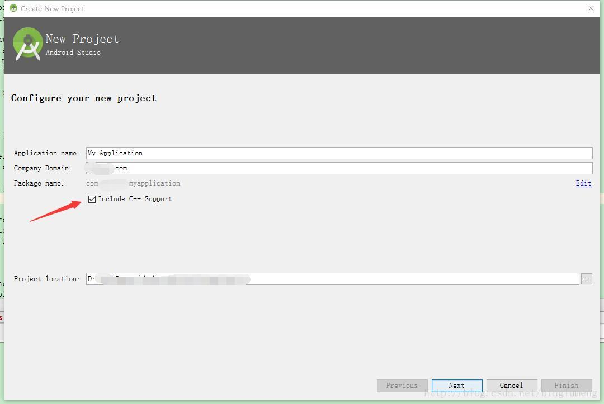

Android开发主流工具已变成AndroidStudio，新版AS已经支持CMake编译工具，可以用于编译C/C++文件，增强了Android调用jni代码的便捷性。相比于之前繁杂的ndk配置方式，cmake较为简单方便。
##1、添加CMake支持
首先使用的AndroidStudio必须是2.2以上版本，在settings--Appearance&Behavior--System Settings--AndroidSDK中，确保下载安装了CMake、LLDB、NDK等必要组件。
使用CMake编译C/C++文件，有两种添加模式：

- 新建项目，在创建项目名称，配置包名时，勾选包含C/C++代码，如图.
- 在已有的项目中添加C/C++代码文件，只需要在app.gradle文件中配置如下代码
```java
defaultConfig{
//配置Cmake运行参数,在defaultconfig节点下配置
        externalNativeBuild {
            cmake {
                cppFlags "-frtti -fexceptions"
            }
        }  
}
 //关联CMake的程序清单文件,path 指向cmake文件路径，此处为项目工程根目录下。
    externalNativeBuild {
        cmake {
            path "CMakeLists.txt"
        }
    }
```

CMakeLists.txt文件如下
```cmake
# Sets the minimum version of CMake required to build the native
# library. You should either keep the default value or only pass a
# value of 3.4.0 or lower.

cmake_minimum_required(VERSION 3.4.1)

# Creates and names a library, sets it as either STATIC
# or SHARED, and provides the relative paths to its source code.
# You can define multiple libraries, and CMake builds it for you.
# Gradle automatically packages shared libraries with your APK.

add_library( # Sets the name of the library.AndroidStudio开始支持Cmake了，ndk感觉挺费劲的，这个是不是好玩点，，这里是要生成的库的文件名 libtest.so
             test

             # Sets the library as a shared library.
             SHARED

             # Provides a relative path to your source file(s).
             # Associated headers in the same location as their source
             # file are automatically included.对应的C文件的目录位置
             src/main/cpp/Test.c)

# Searches for a specified prebuilt library and stores the path as a
# variable. Because system libraries are included in the search path by
# default, you only need to specify the name of the public NDK library
# you want to add. CMake verifies that the library exists before
# completing its build.

find_library( # Sets the name of the path variable.
              log-lib

              # Specifies the name of the NDK library that
              # you want CMake to locate.
              log )

# Specifies libraries CMake should link to your target library. You
# can link multiple libraries, such as libraries you define in the
# build script, prebuilt third-party libraries, or system libraries.

target_link_libraries( # Specifies the target library.指定依赖库
                       test

                       # Links the target library to the log library
                       # included in the NDK.关联日志记录库文件，在ndk目录中
                       ${log-lib} )
```
如上文件中，主要注意add_library中配置你要生成so文件的名称，以及C/C++文件的路径；而target_link_libraries中指定依赖库的文件名。
如此clean project 然后make，就可以生成so文件，被Android上层java调用。类似如下：
```java
	private native static void open(String path);
	public native void close();
	//加载lib库的so文件，要看请lib下面生成的so文件的名字，libtest.so
	static {
		System.loadLibrary("test");
	}
```

##2、最近项目一点零碎知识点
- 多屏幕适配效果优化
```xml
//在AndroidManifest.xml的application节点下，配置
<supports-screens
        android:anyDensity="true"
        android:largeScreens="true"
        android:normalScreens="true"
        android:smallScreens="true"
        android:xlargeScreens="true" />
```
- Activity快速导航返回到主Activity
  使用`android:parentActivityName`属性
```xml
//在activity节点下，配置属性
<activity android:parentActivityName=".activity.WelcomeActivity"
          .../>
```
然后该配置属性的Activity，就可以在back按钮或者其他按钮事件处理中：
```java
//NavUtils是android support包里面的工具类
Intent intent = NavUtils.getParentActivityIntent(this);
        NavUtils.navigateUpTo(this, intent);
```
- EditText不自动获取屏幕焦点
```xml
//在需要屏蔽焦点自动获取的EditText的上一级布局文件中，配置属性
android:focusableInTouchMode="true"
```
- `progress name`属性，在AndroidManifest.xml 中Activitiy或者service的节点属性配置progress name，如果不一致，可能会引起签名打包失败，无法安装apk。

本人技术小白，笔记仅供个人学习记录之中，若能有益于各位网友，也算荣幸。若有问题，肯请指出，莫要责怪。