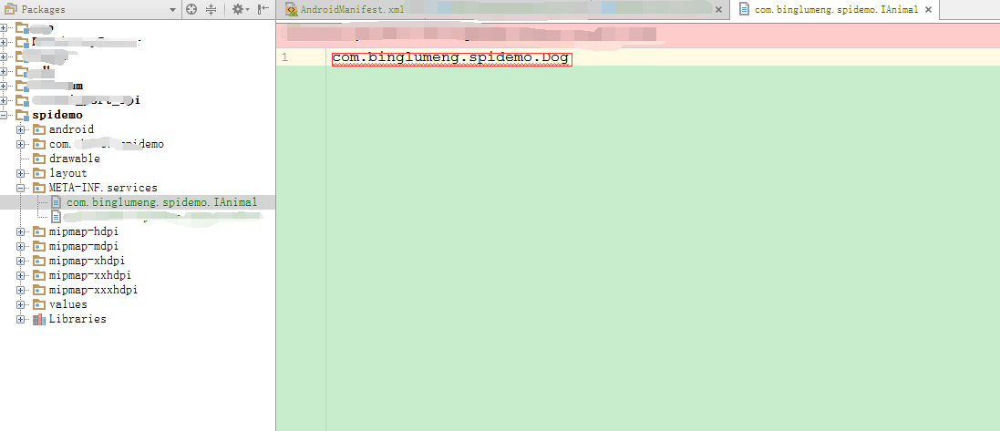

## Android 动态服务SPI的实现

> 声明：此处所谓的SPI是指Service Provider Interfaces，属于Java中动态加载Service的一项技术。
>
> 而非硬件编程中的SPI，那是Serial Peripheral Interface。

本文参照了[元亨利贞o](http://www.jianshu.com/p/10533e5e4410)这位博主的博客，表示感谢。

#### 一、概念

SPI即`Service Provider Interfaces`。Java的接口可以有多种实现方式，为便于代码灵活，有事需要动态加载实现类。这就是SPI机制. SPI机制非常简单, 步骤如下:

1. 定义接口和接口的实现类

2. 创建resources/META-INF/services目录

3. 在上述Service目录下，创建一个以接口名(类的全名) 命名的文件, 其内容是实现类的类名 (类的全名)。

   > 在services目录下创建的文件是`com.binglumeng.spidemo.IAnimal` 文件中的内容为Animal接口的实现类, 可能是`com.binglumeng.spidemo.Dog`

4. 在java代码中使用ServcieLoader来动态加载并调用内部方法.

#### 二、Android中使用SPI

Android上使用SPI的步骤和Java中是一样的. 下面给出实例:

- (1) 创建spi接口, 如下:

```java
package com.binglumeng.spidemo;

public interface IAnimal {
    void run();
}
```

- (2) 实现spi接口, 如下:

```java
package com.binglumeng.spidemo;

import android.util.Log;

import com.binglumeng.spidemo.IAnimal;

public class Dog implements IAnimal {

    @Override
    public void run() {
        Log.i("test", this.getClass().getName() + " == Dog run !");
    }

}
```

- (3) 创建目录`resources/META-INF/services`目录

- (4) 创建以接口命名的文件(`com.binglumeng.spidemo.IAnimal`), 内容为接口的实现类. 下面是spi的描述文件:

  

- (5) 使用ServiceLoader动态查找接口的实现并使用.
  下面是在Activity中查找接口的实现, 并调用接口的方法, 代码如下:

```java
package com.binglumeng.spidemo;

import android.os.Bundle;
import android.support.v7.app.AppCompatActivity;
import android.view.View;

import java.util.Iterator;
import java.util.ServiceLoader;

/**
 * Serial Peripheral Interface 这才是标准的SPI总线
 * 而此处所谓的SpiDemo只是Service Provider Interfaces的动态加载service的演示。
 * 步骤：
 * 1、定义接口和接口实现类
 * 2、创建resources/META-INF/services目录
 * 3、在services目录下创建接口全类名的文件，并且其内容为接口实现类的全类名
 * 4、在java代码中使用ServcieLoader来动态加载并调用内部方法。
 */
public class MainActivity extends AppCompatActivity {

    @Override
    protected void onCreate(Bundle savedInstanceState) {
        super.onCreate(savedInstanceState);
        setContentView(R.layout.activity_main);
    }

    /**
     * Button的onClick属性
     *
     * @param view
     */
    public void showSPI(View view) {
        //通过ServiceLoader来动态加载Service,其中load有几个方法重载，可以尝试
        ServiceLoader<ImageLoader> serviceLoader = ServiceLoader.load(ImageLoader.class, ImageLoader.class.getClassLoader());
     
        Iterator<ImageLoader> it = serviceLoader.iterator();
        if (it.hasNext()) {
            it.next().displayImage();
        }
    }
}
```

点击按钮会输出下面信息:

```java
com.binglumeng.spidemo.Dog == Dog run !
```

 ｡◕‿◕｡ .......