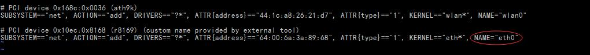

##CentOS服务器网络配置
*本人算是一个热爱折腾技术小白，涉猎技术广泛然而却不精通。*
闲言少叙，且记录近日帮同事搭建测试服务器所遇到的问题，于人于己希望有益。

####1、CentOS系统安装
> 现在新的电脑原带的都是windows10系统，有安全系统之类的设置，简述一下系统安装过程。
>    1、系统启动盘的制作：用LinuxLive制作CentOS 6.5启动盘，在戴尔vostro商用台式机上总是安装过程出问题，也许是同事下载的系统镜像有问题，或者制作过程不对。
>    2、从官网或者centos中国上面下载了6.5的镜像，使用UltraISO制作启动盘，此次使用的是centos6.5 minimal的镜像。
>    3、启动电脑设置取消secure boot选项。开机F12选择U盘启动，进入安装。

**系统安装过程中，也许会选择安装盘的位置，选择自己的U盘sdb1之类的，也会有root账号的设置，请记住，后续登录会使用。**

####2、CentOS网络配置
> 安装好系统之后，启动登录，发现并不能联网，网上搜索各种`ifconfig eth0`的配置，然而本机并没有显示有`eth0` 使用ifconfig -a 查看到只有`lo` 、`p1p1` 、`wlan0` 、三个设备，其中`lo` 是本地回环测试，`wlan0` 是无线网卡（配置它似乎没成功上网，可能和下面的解决步骤的地方有关。）`p1p1` 也许就是本地网卡了，但是在`/etc/sysconfig/network-scripts/ifcfg-p1p1中配置类似网上所说的eth0的配置信息，并无效果，不能实现上网。
> 各种搜索后，在百度知道里看到有个不正确的答案，却给我找到了正确的路径。

> **解决方法**
> 首先编辑`/etc/udev/rules.d/ 70-persistent-net.rules
>
> 1、 将`SUBSYSTEM=="net", ACTION=="add", DRIVERS=="?*", ATTR{address}=="64:00:6a:3a:89:68", ATTR{type}=="1", KERNEL=="eth*", NAME="p1p1"` 中`p1p1` 改成`eth0`
> 2、在`/etc/sysconfig/network-scripts/` 下，copy `ifcfg-p1p1` 重命名为`ifcfg-eth0` ，编辑`ifcfg-eth0` 如下：

> **ifcfg-eth0**
>
> DEVICE=eth0
> HWADDR=64:00:6A:3A:89:68
> TYPE=Ethernet
> UUID=ac0a7654-daad-46dc-914b-526d90494236
> ONBOOT=yes
> NM_CONTROLLED=yes
> BOOTPROTO=none
> IPADDR=192.168.0.144
> PREFIX=24
> DEFROUTE=yes
> IPV4_FAILURE_FATAL=yes
> IPV6INIT=no
> GATEWAY=192.168.0.1
> NETMASK=255.255.255.0
> DNS1=192.168.0.1
> DNS2=114.114.114.114
> NAME="System eth0"

> 注释，DEVICE=eth0,就是网卡设备，对应刚才`70-persistent-net.rules` 中更改的名称`eth0` 。
> HWADDR、UUID从ifcfg-p1p1中复制而来的,不改。
> IPADDR是本机服务器所需要的ip
> GATEWAY是网关
> NETMASK子网掩码
> DNS可自由配置两个公网dns或者公司的路由ip也行。
> 注意的是BOOTPROTO设置为`none` ,ONBOOT设置yes，可以随开机生效配置。

正确完成如上配置，重启服务器，既可以正常上网。*本经验未必通用，请读者自行斟酌。*