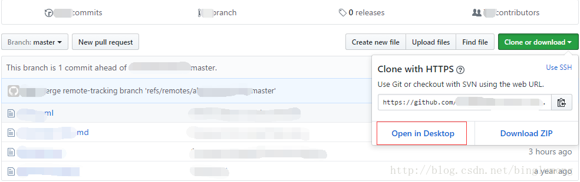
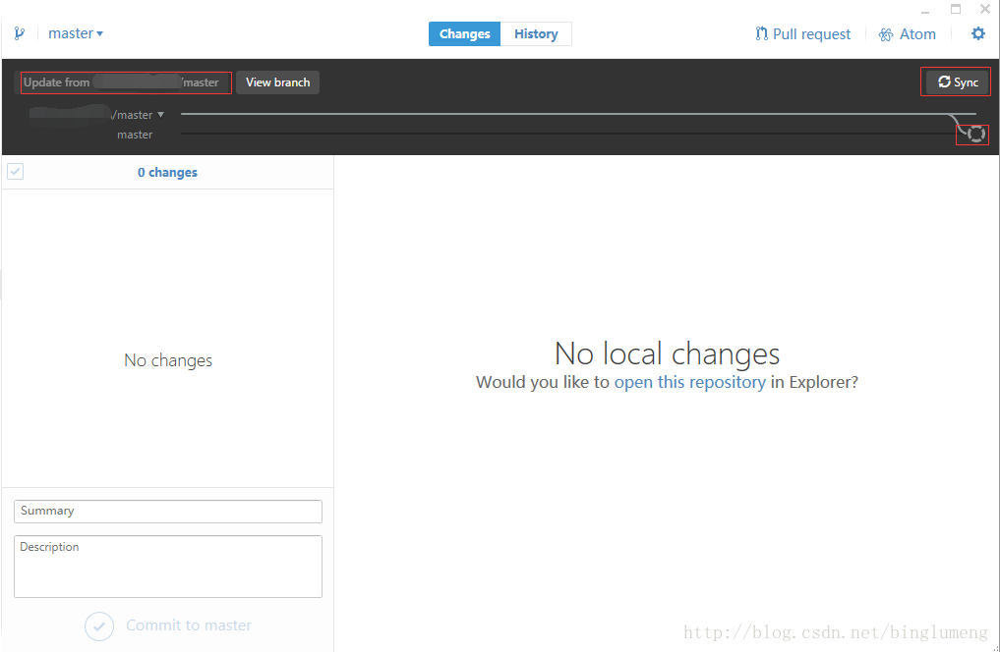

#前言
Github可谓是开发者的乐园，众多的优秀开源项目，有时候我们想关注某个项目，常用的是star，偶尔会fork一下，到个人项目库中，研习代码，更希望有机会可以贡献代码。作为技术小白，现在会遇到已经`fork`的代码，原项目可能更新了，而个人账户下的项目并不能同步更新。如此肯定不利于我们的学习。
# 同步项目
在网上搜索如何同步fork项目和原项目，很多热心的网友的各种解决方案。

- 删除原有项目，在重新fork。(无疑这是暴力有效的，但绝不是我们想要的方式)

- 在电脑本地同时`git clone`原项目和fork项目，用`git pull `更新，然后对比，再`git push`到github上个人代码库。(虽有繁琐，却也是办法)

- 本地`git clone`已fork的项目，然后添加远程库为原项目地址。(当然这里肯定要有项目访问权限的哦)

- 最后也是本人觉得不错的方式，就是用windows下的 github for desktop客户端最为便捷。


> 以上四种方式，前两种基本不用多介绍，主要简介后面来两种的操作。

**使用远程代码库方式：** 转载自[云栖社区](https://yq.aliyun.com/articles/39474)
```sh
首先先通过 github 的 web 页面 fork 目标的项目
前提是自己已经设置好了git,并且配置了相应的权限
然后使用git clone命令在本地克隆自己 fork 的项目：

git clone https://github.com/YOUR-USERNAME/project—name

然后需要复制被自己fork的项目的git地址
切换到自己之前克隆的项目的路径下，使用：

git remote -v
就可以看到当前项目的远程仓库配置

然后使用下面的命令：

git remote add upstream 原始项目仓库的git地址
然后如果你继续使git remove -v命令查看的话，就会发现这个时候已经和原始的被fork的项目产生了关联。
如果想保持项目同步的话，一般使用下面的命令就好了：

git fetch upstream
git merge upstream/master
```
**使用windows 的github客户端**

> 1、首先是PC安装了github客户端，并已经关联了github账号(类似废话)。
> 2、在web上打开已经fork的项目，选在`clone or download`对话框，`open in Desktop`就会调用github的客户端并clone到本地。当然你可以用客户端内直接用git项目地址clone。
> 
> 3、在一段时间后，原项目已经更新，而fork的项目未有更新，此时，在github客户端上，选择如图示的原项目主线---Sync同步，点击update from xxx，再点击选择个人fork的主线---Sync同步。如此可以完成与原有项目的同步。
> 
> <font color="#f00">注意：</font>此时并未出现与原项目代码冲突的情况，暂时先这么记下笔记，以后在做详细分析处理。