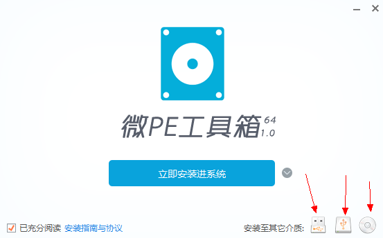
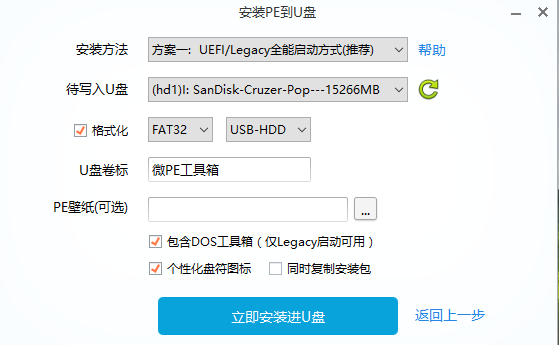
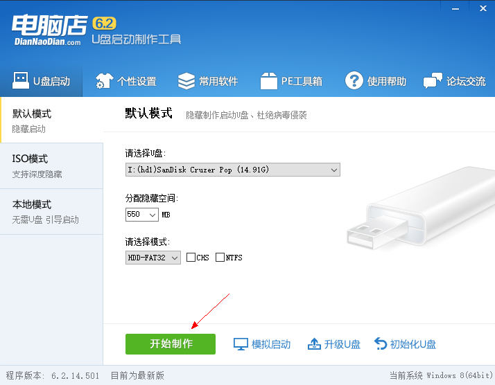
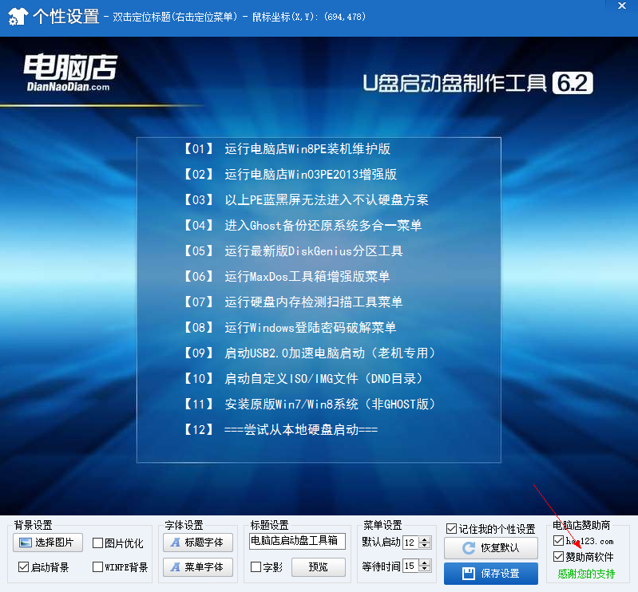

PE系统的制作
一般作为IT工作者或者技术折腾爱好者，都会配备一个PE系统，以备不时之需。PE系统可用于系统维护和紧急救援等，网上PE系统太多，常见的有电脑店、老毛桃、大白菜、微PE等，而其中不少都出于商业目的会在你用其PE安装系统后附带安装一些软件，或者更改主页设置等，个人比较喜欢纯洁的PE系统，本文使用微PE用于演示
一、下载PE系统制作工具

微PE可以安装到U盘，移动硬盘或者生成iso镜像。可以安装到电脑的系统下，启动时就会多出一个启动选项，以备系统崩溃时候进入PE系统即可进行维护。
二、使用空白U盘制作PE系统

三、PE系统的使用
用做好的PE系统U盘，连接电脑，开机启动时进入启动选择菜单，选择USB启动，即可进入相应的PE系统。
另：附上电脑店PE系统的相关制作图片

如上制作的PE会包含捆绑软件和主页设置，在其个性化设置中，取消选项勾选，也许可能消除捆绑的软件安装。（国内软件流氓的太多，没法）

去掉箭头所指的两个勾选，需要输入密码，dnd2012，或者是2012dnd。
文中所需软件可自行在其官网下载，附上个人使用版本：
微PE：
电脑店PE：