# Windows系统安装

声明：本文仅用于技术交流，按照文章操作理论上不会出现故障和问题，但可能由于不同机器、不同人员的不同的偶然的操作失误，会引起不同的未知问题，则不属于本文技术指导的责任，按照本文操作，则视为操作者责任自负。

 

一、安装准备

1、系统源的选择（三种方式）

①、微软官方系统镜像，纯净正版，从源头避免系统附带木马病毒等流氓软件。

[http://msdn.itellyou.cn/](http://msdn.itellyou.cn/)

[http://www.msdn.hk/](http://www.msdn.hk/)

以上为两个常用的原版系统下载网址，在操作系统栏选择所需系统，下载对应的发行版，注意x86和x64的选择。（如今新机器基本都是x64，2010年前的多是x86）

 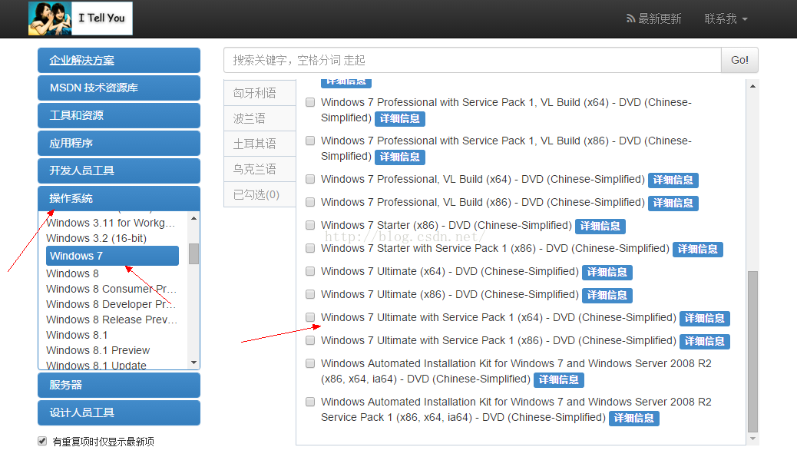

②、第三方Ghost系统，安装简便，免激活，不敢保证无病毒和捆绑软件等。

百度一下Ghost系统，太多下载网址，系统之家相对还算不错。

③、官方OEM系统，相对纯净，免激活，只是不太好找资源。

可根据个人笔记本品牌搜索对应oem系统，如百度“联想win7 oem系统”。

2、安装盘制作（三种方式）

①、光盘刻录，需要空白光盘，使用光驱刻录。刻录工具很多，此处使用软碟通UltralIOS工具刻录：

a）、选择下载好的iso格式的系统镜像，打开。

 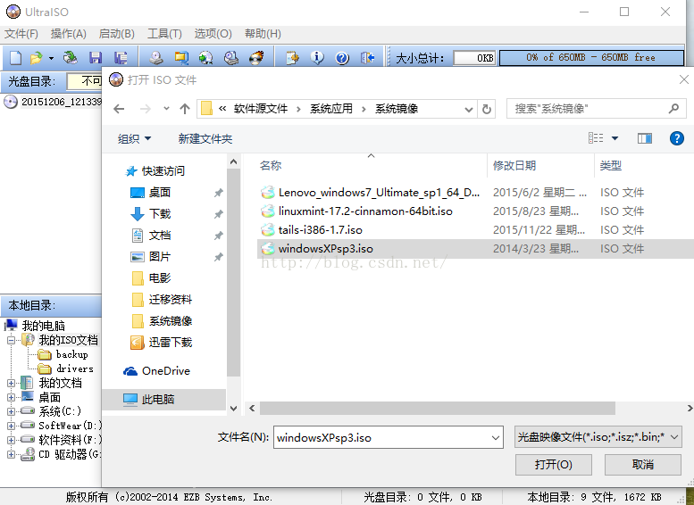

b）、放置空光盘入光驱后，点击如下图位置，刻录光盘。

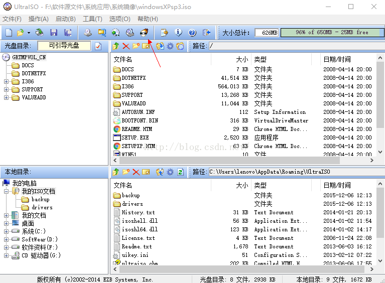

c）、刻录镜像到光盘，等待完成，可选择刻录校验，以保证刻录的完整正确。此处注意光盘的大小空间要大于镜像的大小。一般xp原镜像用cd光碟700M大小即可。Win7或者之后系统需要DVD光碟4.7G大小。

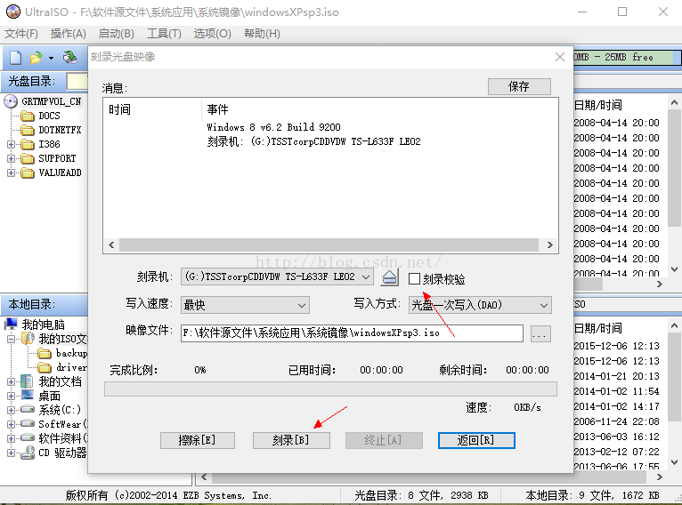

d）、刻录完成后，即可进入安装步骤。

②、U盘刻录，较光盘安装效率更高，U盘大小需要大于iso镜像。依然用UltralISO刻录。

a)、打开下载后的iso系统镜像。

b)、选择启动--写入硬盘镜像。

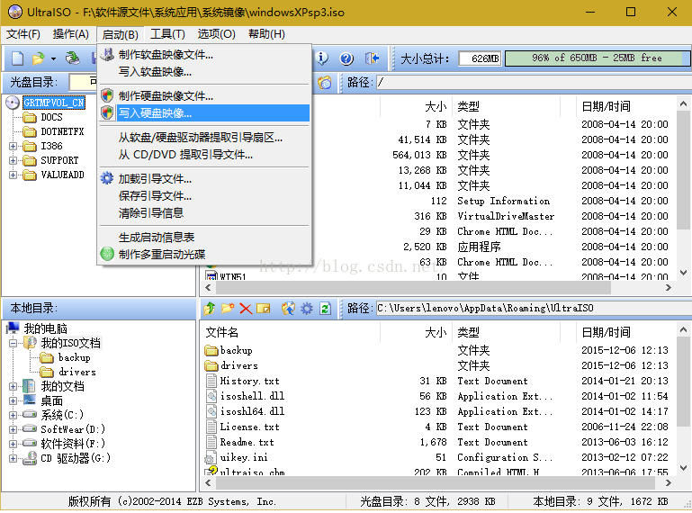

c)、放入空白U盘（会被格式化，U盘上资料提前备份到他处），写入usb-hdd+引导。写入方式也选择usb-hdd+

 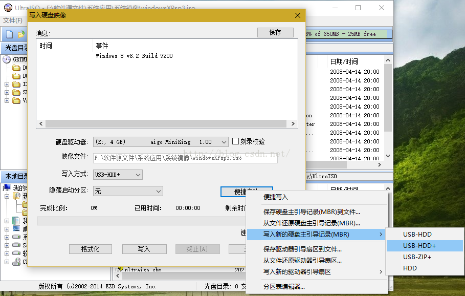 

d)、格式化，写入完成后进入安装步骤。

③、硬盘安装，安装速度快，对新手操作略繁琐（主要指PE系统的使用）

a)、xp-->win7，或者类似的低版本系统升级高版本系统，且两个系统都是x86或者x64的，可以将下载后的iso系统镜像文件，用winRAR之类的解压缩工具解压到非C盘的磁盘目录下，然后双击运行Setup.exe即可进入安装步骤。

b)、上一步也可以用虚拟光驱工具，加载iso系统镜像，然后再“我的电脑”下找到加载后的系统安装盘，双击运行其中的setup.exe进入安装步骤。

 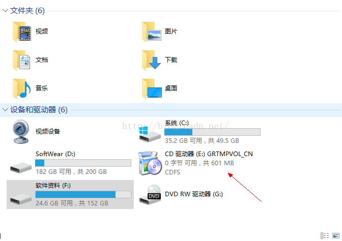

 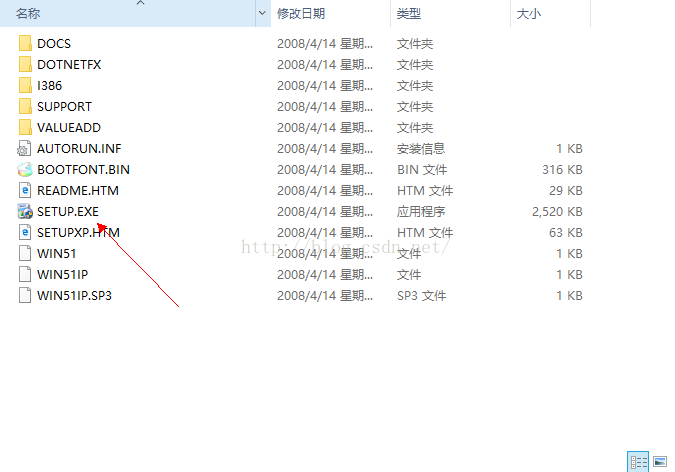

c)、如上两条均需要当前系统可用的前提下，满足一定条件才可实现。倘若系统崩溃无法进入系统，则需要使用其他电脑制作安装光盘/U盘，放于本电脑来安装。亦或者，有PE系统，进入PE系统环境安装。（PE系统的制作，稍后再讲）

三、系统安装

1、将制作好的安装光盘/U盘连接电脑

2、开机选择进入启动选择菜单，不同品牌电脑的进入方式不同，一般在开机显示品牌LOGO时，下面会有提示。Lenovo是按F12进入快速选择启动项，其他品牌自行百度，如“联想进入开机选项方式”。一般为Delete，Esc，F2等。

3、进入启动项菜单后，若是光盘为安装盘，一般不用上一步就会进入安装界面，但有的也需要在此步骤选择光驱启动，回车即可。U盘为安装盘，则选择对应的USB启动项。

4、如上无误则进入安装界面，一路下一步即可

 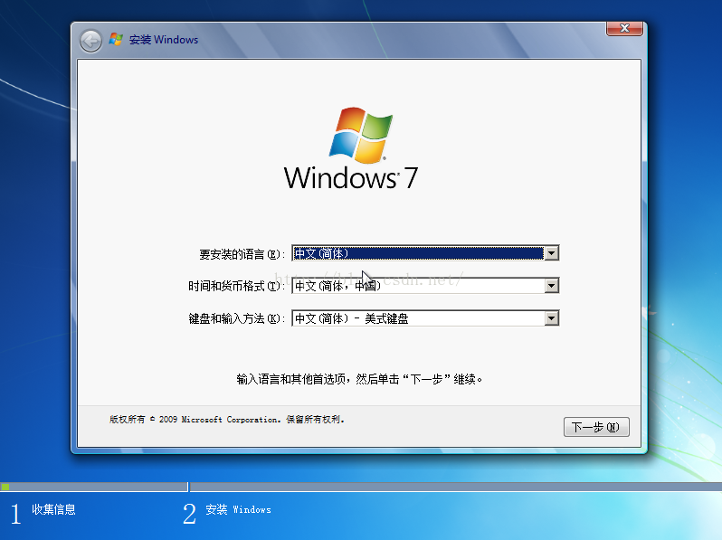 

5、在下图步骤时，非全新硬盘则选择C盘，可以点击高级选项中，可以格式化，分区等，C盘数据会丢失，所以安装系统前备份好个人C盘的重要资料，如我的文档，桌面等等上面的资料。（崩溃后的系统可以在PE环境下备份数据）

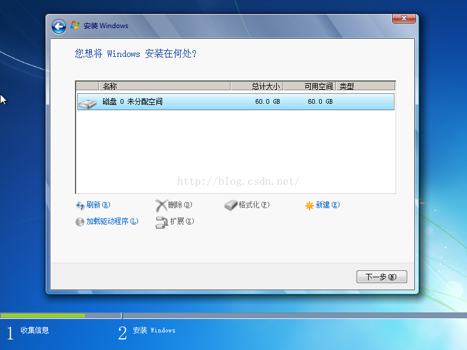

6、几乎一路下一步就可完成安装，系统可能会让提供安装密钥，可百度相应系统的序列号即可。（在第一步中选择的不同系统源，决定安装步骤的差异，一般大致相同）

 

 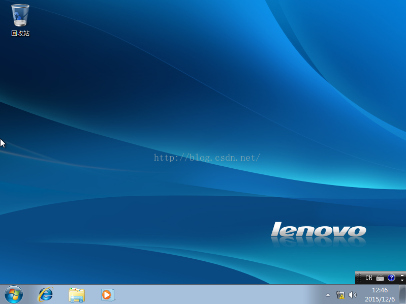

四、系统设置及优化

至此即可完成系统的安装，windows系列的安装大同小异，安装好系统仅仅是一个好的桌面系统环境的第一步，之后需要打补丁，装软件，优化设置，其重要性不亚于系统的安装，有一个良好的使用习惯，会让你的电脑保持较为长久的流畅和高效状态。

纯净初装系统并无集成驱动，甚至无法联网，用户需要从他处下载带网卡驱动的驱动精灵或驱动人生等，安装后一键安装所有必须的驱动，同时安装必要的软件，安装补丁等。

需要注意的是下载软件尽可能都在官网下载，安装时候注意选择自定安装，留心去掉需要没用的默认勾选，否则可能会被附带安装太多不要的东西。安装软件建议安装到D盘下自建一个公用目录，最好英文无空格，以免极个别奇葩软件无法运行。

任何软件的安装后，都需要进行设置，更改其设置中暗含的默认选项，免除流氓广告和其他无关行为。

系统装好驱动和补丁后，及时清理系统垃圾，优化设置，具体优化无法一篇概论，提供一些个人用的优化工具，请自行使用，优化工具需要善用，错误操作责任自负。

另：建议系统设置优化完成后，安装一个Ghost备份工具，备份系统，或者是本地PE系统，以备不时之需。

 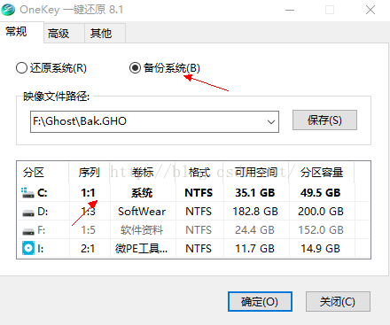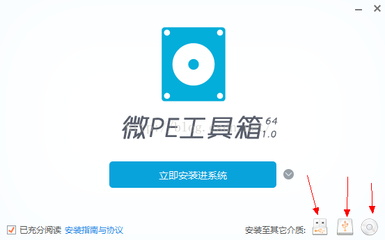

附件：本文所需工具均可自行在网上下载官方版本。---UltralISO：OneKey：微PE：魔方优化：--- 