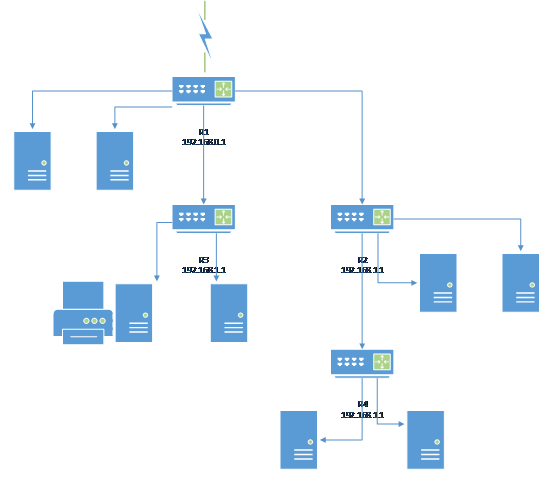

笔者技术小白一个，喜爱折腾而已。目前就职小公司，岗位也非网管，出于兴趣而愿意多做一些技术工作。本本简介笔者所在小型公司的内部局域网共享问题的处理。
#### 1、内网情况

>小型公司，十多人的网络设备，无交换机，仅有的是家用型的普通路由器。
>目的需求是实现公司内部网络共享一个打印机和实现文件共享。用户的网络链接于多个不同的普通路由器下面，一般是跨网段的。

#### 2、解决方式

>经过笔者的多方资料查询与尝试，什么静态路由表设置，子网掩码修改，关闭防火墙，修改网络配置ip等等，似乎军委实现所需效果。

问题分析
>之前的内网分布情况是外网通过一个路由器R1下分四个出口，连接了两个子路由R2、R3、又由于距离问题，R2下面又分出一个子路由R4。各自路由下还有其他电脑主机连接。

>想必有人会吐槽这么个网络布局方式，或者说可以购买企业级路由，交换机实现问题解决。我只能说当下情况就是如此。

>跨网段的网络共享，基于当下的网络和设备情况，个人技术未能实现。所以变相让所有设备处于同一网段，于是将R2、R3、R4变为交换机使用，而不作为路由器。（普通家用路由器，其实就是具有路由功能的小型交换机）为此，需要做的是，先将R2、R3、R4路由器设置不适用DHCP自动分配网址的功能，切保证R2、R3、R4这三个路由器的ip网址是192.168.1.1、192.168.2.1之类的，不同于R1的192.168.0.1其实就是不让三个子路由的ip内网和路由ip在同一网段。（因为两个360路由器，即使一个是子路由，依然可以设置和上级路由一个ip段，故而才有此说明）。
>三个自路由都不用wan口，入口网线同出口网线一样，接入lan口。R1路由配置DHCP自动配置ip，各个终端电脑设备ip配置是自动获取ip，如此基本就实现了所有终端的同网段。

#### 3、共享打印机和文件

>文件和打印机的共享，需要一个在家庭网状态下才行，win10里面叫做专用网络。
>链接打印机的电脑设置共享打印机，且创建或加入一个公司内部的家庭网，其他成员也加入同一家庭组。在控制面板--设置--硬件和设备---新增打印机，选择网络打印机，点击浏览，选择共享打印机的电脑终端，就可以看到下面共享的打印机。
>文件共享，情况类似，在同一个工作组内，就可以实现共享文件。

毕竟个人算是技术小白，所述信息未必全部正确，仅此笔记记录，也便于共享大家。

