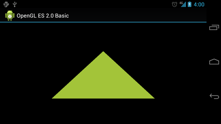

## 第四篇、Android图像与动画
[TOC]
### 第1章、高效显示Bitmap

本节主要介绍加载处理Bitmap对象常用方法，以避免UI线程阻塞与OOM问题。由于Android设备

- Android单个应用至少16M内存，不同分辨率屏幕的设备要求不同。`国内自定义ROM限制也有差异。`
- Bitmap消耗内存，一张5M的高清照片，使用ARGB_8888方式加载Bitmap，则需要19M左右的内存。
- Android应用一般加载多个Bitmap，预先加载以备显示。

所以如上三条，需要我们对Bitmap做优化处理。

#### 1、高效加载大图（Loading Large Bitmap Efficiently）

本节介绍加载缩小的图片，来避免过多消耗内存，原始大小的图片和超过控件大小和设备分辨率的图片加载，在显示上并无意义，反而带来内存风险。

- ##### 读取位图尺寸与类型（Read Bitmap Dimensions and Type）

  `BitmapFactory`提供了不同类型的decode方法，配有`BitmapFactory.Options`选项来标记解码方式。

  设置`inJustDecodeBounds=true`属性可以避免解码时候分配内存。其返回`null`的Bitmap，但是可以用于获取长宽和类型。

  ```java
  BitmapFactory.Options options = new BitmapFactory.Options();
  options.inJustDecodeBounds = true;//不加载分配内存
  BitmapFactory.decodeResource(getResource(),R.drawable.iclauncher,options);
  //图像长宽
  int imgWidth = options.outWidth;
  int imgHeight = options.outHeight;
  String imgType = options.outMimeType;//图像类型
  ```

  *一般需要在加载图片前判断图片大小，避免OOM，除非你确保不会OOM*

- ##### 加载缩小版图片到内存（Load a Scale Down Version into Memory）

  加载缩小版图片也需要考虑一些因素：

  - 评估完整图片加载需耗内存。
  - 加载图片可能涉及到的其他内存需求。
  - 显示图片的控件尺寸。
  - 设备屏幕的密度和大小。

  BitmapFactory.Options中设置`inSampleSize`来确定缩放比。

  ```java
  /**
   * 计算图像缩放比
   */
  public static int calculateInSampleSize(
              BitmapFactory.Options options, int reqWidth, int reqHeight) {
      // 获取图像的原始大小
      final int height = options.outHeight;
      final int width = options.outWidth;
      int inSampleSize = 1;
      if (height > reqHeight || width > reqWidth) {
          final int halfHeight = height / 2;
          final int halfWidth = width / 2;
          //保持宽高大于请求的宽高，缩放比为计算值的2倍
          while ((halfHeight / inSampleSize) > reqHeight
                  && (halfWidth / inSampleSize) > reqWidth) {
              inSampleSize *= 2;
          }
      }
      return inSampleSize;
  }
  ```

  ==*设置缩放比`inSampleSize`为2的倍数，是因为解码器对非2倍数会就近处理为2的倍数。*==

  先设置`inJustDecodeBounds=true`来设置`inSampleSize`之后在设置`inJustDecodeBounds=false`加载缩放后的Bitmap

  ```java
  mImageView.setImageBitmap(decodeSampleBitmapFromResource(getResource(),R.drawable.iclauncher,100,100));//加载大小100长宽的图片
  /*
   * 根据控件大小，加载缩放图片
   */
  public static Bitmap decodeSampleBitmapFromResource(Resource res,int resId,int reqWidth,int reqHeight){
    //先空加载图片，计算缩放比
    final BitmapFactory.Options options = new BitmapFactory.Options();
    options.inJustDecodeBounds = true;
    BitmapFactory.decodeResource(res,resId,options);
    options.inSampleSize = calculateInSampleSize(options,reqWidth,reqHeight);
    //解码缩放后的图像
    options.inJustDecodeBounds = false;
    returen BitmapFactory.decodeResource(res,resId,options);
  }
  ```

#### 2、非UI线程处理Bitmap

上一节仅仅介绍了如何缩放加载图像，若是获取网络图像或者其他储存设备，则应避免在UI线程执行加载操作，避免ANR。

- ##### 使用AsyncTask（Use a AsyncTask）

  AsyncTask是Android提供的一个封装好的后台线程操作方式，并可以实现前后台信息传递。

  ```java
  class BitmapWorkerTask extends AsyncTask{
    private final WeakReference imageViewReference;
    private int data = 0;
    public BitmapWorkerTask(ImageView imageView){
      //使用弱引用，确保图像会被及时的GC回收。
      imageViewReference = new WeakReference(imageView);
    }
    //后台解码图片
    @override
    protected Bitmap doInBackground(Integer... params){
      data = params[0];
      return decodeSampleBitmapFromResource(getResource(),data,100,100);
    }
    //完成解码后，加载图像到控件显示
    //要判断引用对象是否还存在，控件是否存在等，避免空指针。
    @override
    protected void onPostExecute(Bitmap bitmap){
      if(imageViewReference !=null && bitmap !=null){
        final ImageView imageView = imageViewReference.get();
        if(imageView!=null){
          imageView.setImageBitmap(bitmap);
        }
      }
    }
  }
  //创建一个任务task，执行异步加载
  public void loadBitmap(int resId,ImageView imageView){
    BitmapWorkerTask task = new BitmapWorkerTask(imageView);
    task.execute(resId);//执行Task
  }
  ```

- ##### 处理并发问题（Handle Concurrency）

  List View和Grid View控件显示多个位图结合AsyncTask使用时会产生并发问题。每个item都执行task的话，启动顺序，任务顺序都很难保持一致性。为此可以使用Image View来保存最近使用的AsyncTask引用，创建一个专用的`Drawable`子类来存储任务引用，如`BitmapDrawable`,并提供占位图像:

  ```java
  static class AsyncDrawable extends BitmapDrawable{
    private final WeakReference bitmapWorkerTaskReference;
    public AsyncDrawable(Resource res,Bitmap bitmap,BitmapWorkerTask bitmapWorkerTask){
      super(res,bitmap);
      //初始化弱引用对象
      bitmapWorkerTaskReference = new BitmapWorkerTaskReference(bitmapWorkerTask);
    }
    //对外公开task的引用。
    public BitmapWorkerTask getBitmapWorkerTask(){
      return bitmapWorkerTaskReference.get();
    }
  }
  ```

  在执行BitmapWorkerTask之前需要创建AsyncDrawable并绑定到ImageView上：

  ```java
  public void loadBitmap(int resId,ImageView imageView){
    if(cancelPotentialWork(resId,imageView)){
      final BitmapWorkerTask task = new BitmapWorkerTask(imageView);
      final AsyncDrawable asyncDrawable = new 							   AsyncDrawable(getResource(),mPlaceHolderBitmap,task);
      imageView.setImageDrawable(asyncDrawable);
      task.execute(resId);
    }
  }
  //该方法用于检测是否有已存在的任务在执行该Image View控件的请求。
  public static boolean cancelPotentialWork(int data, ImageView imageView) {
  	//检索AsyncTask是否已经被分配到指定的ImageView控件。
    final BitmapWorkerTask bitmapWorkerTask = getBitmapWorkerTask(imageView);
      if (bitmapWorkerTask != null) {
          final int bitmapData = bitmapWorkerTask.data;
          if (bitmapData == 0 || bitmapData != data) {
              //取消先前的任务
              bitmapWorkerTask.cancel(true);
          } else {
              //同样的请求任务已经在执行
              return false;
          }
      }
      //没有符合当下请求的任务绑定在ImageView控件上，或者之前的取消了。
      return true;
  }
  //获取控件相关的task
  private static BitmapWorkerTask getBitmapWorkerTask(ImageView imageView) {
     if (imageView != null) {
         final Drawable drawable = imageView.getDrawable();
         if (drawable instanceof AsyncDrawable) {
             final AsyncDrawable asyncDrawable = (AsyncDrawable) drawable;
           //获取AsyncDrawable中定义的绑定task引用
             return asyncDrawable.getBitmapWorkerTask();
         }
      }
      return null;
  }
  ```

  完成异步task的绑定后，在`onPostExecute()`中更新view

  ```java
  class BitmapWorkerTask extends AsyncTask {
      ...

      @Override
      protected void onPostExecute(Bitmap bitmap) {
          if (isCancelled()) {
              bitmap = null;
          }
  		//更新View前，判断资源和控件的非空
          if (imageViewReference != null && bitmap != null) {
              final ImageView imageView = imageViewReference.get();
              final BitmapWorkerTask bitmapWorkerTask =
                      getBitmapWorkerTask(imageView);
              if (this == bitmapWorkerTask && imageView != null) {
                  imageView.setImageBitmap(bitmap);
              }
          }
      }
  }
  ```

  应用与listView和GridView等，循环利用子视图的控件，只要在设置ImageView的地方调用loadBitmap方法即可。如GridView的`getView()`中。

#### 3、缓存Bitmap

在List View或GridView控件场景中，可能需要大量图片展示，而且存在图片复用现象，此时就需要用到缓存，以提高效能和用户体验。

- ##### 使用内存缓存（Use a Memory Cache）

  使用内存缓存实现以_空间换时间_，提高速度。`LruCache`类用于缓存Bitmaps，其使用强引用`LinkedHashMap`保存最近引用对象，在缓存超出设置大小时候剔除最近最少使用的对象。

  > **注意：**以前多使用`软引用`或`弱引用`但是现在并不推荐，由于Android版本的GC频率增高，引用效率也大为降低。

  为LruCache设置合适的大小，考虑一下因素：

  - 应用剩余可用内存大小
  - 同时显示图像数量，以及预加载图片数量
  - 设备屏幕尺寸与密度
  - 图像尺寸、类型
  - 图像被访问的频率高低
  - 显示图像的质量和数量的平衡

  以上因素都需要具体分析，如下创建一个Bitmap的LruCache的示例：

  ```java
  private LruCache<String, Bitmap> mMemoryCache;

  @Override
  protected void onCreate(Bundle savedInstanceState) {
      ...
      // 获取应用VM最大可用内存
      final int maxMemory = (int) (Runtime.getRuntime().maxMemory() / 1024);

      // 使用可用内存的1/8来缓存
      final int cacheSize = maxMemory / 8;
  	//建立LruCache缓存对象
      mMemoryCache = new LruCache<String, Bitmap>(cacheSize) {
          @Override
          protected int sizeOf(String key, Bitmap bitmap) {
              // 缓存以KB为单位计算，而非对象item个数
              return bitmap.getByteCount() / 1024;
          }
      };
      ...
  }
  //加入bitmap对象到lrucache
  public void addBitmapToMemoryCache(String key, Bitmap bitmap) {
      if (getBitmapFromMemCache(key) == null) {
          mMemoryCache.put(key, bitmap);
      }
  }
  //从lrucache获取bitmap缓存
  public Bitmap getBitmapFromMemCache(String key) {
      return mMemoryCache.get(key);
  }
  ```

  > **Note:**在上面的例子中, 有1/8的内存空间被用作缓存。 这意味着在常见的设备上（hdpi），最少大概有4MB的缓存空间（32/8）。如果一个填满图片的GridView控件放置在800x480像素的手机屏幕上，大概会花费1.5MB的缓存空间（800x480x4 bytes），因此缓存的容量大概可以缓存2.5页的图片内容。

  加入缓存的bitmap亦是已经优化过的图像：

  ```java
  class BitmapWorkerTask extends AsyncTask<Integer, Void, Bitmap> {
      ...
      //异步线程解码图像
      @Override
      protected Bitmap doInBackground(Integer... params) {
        //缩放图像
          final Bitmap bitmap = decodeSampledBitmapFromResource(
                  getResources(), params[0], 100, 100));
        //添加到lrucache缓存
          addBitmapToMemoryCache(String.valueOf(params[0]), bitmap);
          return bitmap;
      }
      ...
  }
  ```

- ##### 使用磁盘缓存（Use a Disk Cache）

  使用内存作为缓存虽然有较高的速度，但也可能因为应用被后台化，系统资源不足，亦或者过于大量的图像加载，而导致效果不佳，体验不好。因而可以使用磁盘缓存，需要异步处理，避免ANR。

  > **Note:**如果图像过于频繁访问，可以使用`ContentProvider`更为合适。

  如下示例`DiskLruCache`为Android源码基础上优化的：

  ```java
  private DiskLruCache mDiskLruCache;//DiskLruCache对象
  private final Object mDiskCacheLock = new Object();//常量化同步锁
  private boolean mDiskCacheStarting = true;//是否开启缓存
  private static final int DISK_CACHE_SIZE = 1024 * 1024 * 10; // 10MB
  private static final String DISK_CACHE_SUBDIR = "thumbnails";//缓存文件夹

  @Override
  protected void onCreate(Bundle savedInstanceState) {
      ...
      // 初始化内存缓存
      ...
      // 后台线程初始化磁盘缓存
      File cacheDir = getDiskCacheDir(this, DISK_CACHE_SUBDIR);//从磁盘加载出缓存文件
      new InitDiskCacheTask().execute(cacheDir);//异步开始加载到缓存文件
      ...
  }
  //内部类，初始化磁盘加载task
  class InitDiskCacheTask extends AsyncTask<File, Void, Void> {
      @Override
      protected Void doInBackground(File... params) {
          synchronized (mDiskCacheLock) {//同步锁
              File cacheDir = params[0];//缓存文件
              mDiskLruCache = DiskLruCache.open(cacheDir, DISK_CACHE_SIZE);
              mDiskCacheStarting = false; //完成初始化磁盘加载
              mDiskCacheLock.notifyAll(); //唤起其他休眠线程
          }
          return null;
      }
  }
  //异步加载图片的task，
  class BitmapWorkerTask extends AsyncTask<Integer, Void, Bitmap> {
      ...
      // 解码图像
      @Override
      protected Bitmap doInBackground(Integer... params) {
          final String imageKey = String.valueOf(params[0]);

          //后台线程检查磁盘缓存
          Bitmap bitmap = getBitmapFromDiskCache(imageKey);

          if (bitmap == null) { // 磁盘缓存没有所需图像
              // 正常途径加载
              final Bitmap bitmap = decodeSampledBitmapFromResource(
                      getResources(), params[0], 100, 100));
          }

          //并将优化后的图像加入磁盘缓存
          addBitmapToCache(imageKey, bitmap);

          return bitmap;
      }
      ...
  }
  //加入磁盘缓存
  public void addBitmapToCache(String key, Bitmap bitmap) {
      // 先加入内存缓存
      if (getBitmapFromMemCache(key) == null) {
          mMemoryCache.put(key, bitmap);
      }

      // 然后加入到磁盘缓存
      synchronized (mDiskCacheLock) {
          if (mDiskLruCache != null && mDiskLruCache.get(key) == null) {
              mDiskLruCache.put(key, bitmap);
          }
      }
  }
  //从磁盘缓存获取图像
  public Bitmap getBitmapFromDiskCache(String key) {
      synchronized (mDiskCacheLock) {//同步获取锁
          // 等待后台线程获取磁盘缓存
          while (mDiskCacheStarting) {
              try {
                  mDiskCacheLock.wait();
              } catch (InterruptedException e) {}
          }
          if (mDiskLruCache != null) {
              return mDiskLruCache.get(key);
          }
      }
      return null;
  }

  // 为特定的app创建唯一的子文件夹，优先使用外部sd卡，若没有，就使用内部sd卡
  public static File getDiskCacheDir(Context context, String uniqueName) {
      // 检查是否有外部存储，否则用内部存储
      final String cachePath =
              Environment.MEDIA_MOUNTED.equals(Environment.getExternalStorageState()) ||
                      !isExternalStorageRemovable() ? getExternalCacheDir(context).getPath() :
                              context.getCacheDir().getPath();

      return new File(cachePath + File.separator + uniqueName);
  }
  ```

  > **注意：**如上使用==同步锁==是为了防止在后台异步I/O操作时候，错误读取。

  内存缓存检查可以在UI线程操作，而磁盘缓存需要在后台线程。

- ##### 处理配置改变（Handle Configuration Changes）

  Android的配置信息发生变化，Activity可能会随之变化、销毁重建。平滑恢复原有图像，创造良好用户体验，`setRetainInstance(true)`保留的一个`Fragement`实例可以将缓存重新附着与Activity上。

  ```java
  private LruCache<String, Bitmap> mMemoryCache;

  @Override
  protected void onCreate(Bundle savedInstanceState) {
      ...
        //RetainFragment
      RetainFragment retainFragment =
              RetainFragment.findOrCreateRetainFragment(getFragmentManager());
    //获取缓存对象  
    mMemoryCache = retainFragment.mRetainedCache;
      if (mMemoryCache == null) {
          mMemoryCache = new LruCache<String, Bitmap>(cacheSize) {
              ... // 初始化缓存
          }
          retainFragment.mRetainedCache = mMemoryCache;
      }
      ...
  }
  //自定义内部类Fragment，用于存储缓存对象？？
  class RetainFragment extends Fragment {
      private static final String TAG = "RetainFragment";
      public LruCache<String, Bitmap> mRetainedCache;

      public RetainFragment() {}

      public static RetainFragment findOrCreateRetainFragment(FragmentManager fm) {
          RetainFragment fragment = (RetainFragment) fm.findFragmentByTag(TAG);
          if (fragment == null) {
              fragment = new RetainFragment();
              fm.beginTransaction().add(fragment, TAG).commit();
          }
          return fragment;
      }

      @Override
      public void onCreate(Bundle savedInstanceState) {
          super.onCreate(savedInstanceState);
          setRetainInstance(true);
      }
  }
  ```

#### 4、管理Bitmap的内存

关于Bitmap内存管理了解两点：1、Android2.3之后GC回收并发执行，内存不引用，会被立即回收。2、Android3.0以后bitmap引用和数据一同存放在`Dalvik堆`内存中。

- ##### Android2.3以下版本的内存管理

  推荐使用`recycle()`方法，低版本Android单线程GC。使用引用计数法：

  ```java
  private int mCacheRefCount=0;//引用计数
  private int mDisplayRefCount = 0;//引用计数
  ...
  //通知drawable显示状态发生改变，drawable引用计数来决定引用状态和显示
  public void setIsDisplayed(boolean isDisplayed) {
      synchronized (this) {
          if (isDisplayed) {
              mDisplayRefCount++;
              mHasBeenDisplayed = true;
          } else {
              mDisplayRefCount--;
          }
      }
      // Check to see if recycle() can be called.
      checkState();
  }
  // Notify the drawable that the cache state has changed.
  // Keep a count to determine when the drawable is no longer being cached.
  public void setIsCached(boolean isCached) {
      synchronized (this) {
          if (isCached) {
              mCacheRefCount++;
          } else {
              mCacheRefCount--;
          }
      }
      // Check to see if recycle() can be called.
      checkState();
  }

  private synchronized void checkState() {
      // If the drawable cache and display ref counts = 0, and this drawable
      // has been displayed, then recycle.
      if (mCacheRefCount <= 0 && mDisplayRefCount <= 0 && mHasBeenDisplayed
              && hasValidBitmap()) {
          getBitmap().recycle();
      }
  }
  private synchronized boolean hasValidBitmap() {
      Bitmap bitmap = getBitmap();
      return bitmap != null && !bitmap.isRecycled();
  }
  ```

- ##### Android3.0以上版本内存管理

  API 11引入`BitmapFactory.Options.inBitmap`使Bitmap在加载时候可以重中已存在的，但是大小一样的位图（< API 19时候）。

- 保存Bitmap以备复用

  android3.0以上，bitmap从L如Cache移除时，Bitmap的软引用会被村房子啊Hashset中，以便`inBitmap`复用。

  ```java
  Set<SoftReference<Bitmap>> mReusableBitmaps;
  private LruCache<String, BitmapDrawable> mMemoryCache;

  // If you're running on Honeycomb or newer, create a
  // synchronized HashSet of references to reusable bitmaps.
  if (Utils.hasHoneycomb()) {
      mReusableBitmaps =
              Collections.synchronizedSet(new HashSet<SoftReference<Bitmap>>());
  }

  mMemoryCache = new LruCache<String, BitmapDrawable>(mCacheParams.memCacheSize) {

      // Notify the removed entry that is no longer being cached.
      @Override
      protected void entryRemoved(boolean evicted, String key,
              BitmapDrawable oldValue, BitmapDrawable newValue) {
          if (RecyclingBitmapDrawable.class.isInstance(oldValue)) {
              // The removed entry is a recycling drawable, so notify it
              // that it has been removed from the memory cache.
              ((RecyclingBitmapDrawable) oldValue).setIsCached(false);
          } else {
              // The removed entry is a standard BitmapDrawable.
              if (Utils.hasHoneycomb()) {
                  // We're running on Honeycomb or later, so add the bitmap
                  // to a SoftReference set for possible use with inBitmap later.
                  mReusableBitmaps.add
                          (new SoftReference<Bitmap>(oldValue.getBitmap()));
              }
          }
      }
  ....
  }
  ```

- ##### 使用已经存在的Bitmap

  ```java
  public static Bitmap decodeSampledBitmapFromFile(String filename,
          int reqWidth, int reqHeight, ImageCache cache) {

      final BitmapFactory.Options options = new BitmapFactory.Options();
      ...
      BitmapFactory.decodeFile(filename, options);
      ...

      // If we're running on Honeycomb or newer, try to use inBitmap.
      if (Utils.hasHoneycomb()) {
          addInBitmapOptions(options, cache);
      }
      ...
      return BitmapFactory.decodeFile(filename, options);
  }
  //查找适合且可复用的bitmap，设置到inBitmap的属性值，
  private static void addInBitmapOptions(BitmapFactory.Options options,
          ImageCache cache) {
      // inBitmap only works with mutable bitmaps, so force the decoder to
      // return mutable bitmaps.
      options.inMutable = true;

      if (cache != null) {
          // Try to find a bitmap to use for inBitmap.
          Bitmap inBitmap = cache.getBitmapFromReusableSet(options);

          if (inBitmap != null) {
              // If a suitable bitmap has been found, set it as the value of
              // inBitmap.
              options.inBitmap = inBitmap;
          }
      }
  }

  // This method iterates through the reusable bitmaps, looking for one
  // to use for inBitmap:
  protected Bitmap getBitmapFromReusableSet(BitmapFactory.Options options) {
          Bitmap bitmap = null;

      if (mReusableBitmaps != null && !mReusableBitmaps.isEmpty()) {
          synchronized (mReusableBitmaps) {
              final Iterator<SoftReference<Bitmap>> iterator
                      = mReusableBitmaps.iterator();
              Bitmap item;

              while (iterator.hasNext()) {
                  item = iterator.next().get();

                  if (null != item && item.isMutable()) {
                      // Check to see it the item can be used for inBitmap.
                      if (canUseForInBitmap(item, options)) {
                          bitmap = item;

                          // Remove from reusable set so it can't be used again.
                          iterator.remove();
                          break;
                      }
                  } else {
                      // Remove from the set if the reference has been cleared.
                      iterator.remove();
                  }
              }
          }
      }
      return bitmap;
  }
  ```

  判断Bitmap是否符合inBitmap的要求：

  ```java
  static boolean canUseForInBitmap(
          Bitmap candidate, BitmapFactory.Options targetOptions) {

      if (Build.VERSION.SDK_INT >= Build.VERSION_CODES.KITKAT) {
          // From Android 4.4 (KitKat) onward we can re-use if the byte size of
          // the new bitmap is smaller than the reusable bitmap candidate
          // allocation byte count.
          int width = targetOptions.outWidth / targetOptions.inSampleSize;
          int height = targetOptions.outHeight / targetOptions.inSampleSize;
          int byteCount = width * height * getBytesPerPixel(candidate.getConfig());
          return byteCount <= candidate.getAllocationByteCount();
      }

      // On earlier versions, the dimensions must match exactly and the inSampleSize must be 1
      return candidate.getWidth() == targetOptions.outWidth
              && candidate.getHeight() == targetOptions.outHeight
              && targetOptions.inSampleSize == 1;
  }

  /**
   * A helper function to return the byte usage per pixel of a bitmap based on its configuration.
   */
  static int getBytesPerPixel(Config config) {
      if (config == Config.ARGB_8888) {
          return 4;
      } else if (config == Config.RGB_565) {
          return 2;
      } else if (config == Config.ARGB_4444) {
          return 2;
      } else if (config == Config.ALPHA_8) {
          return 1;
      }
      return 1;
  }
  ```

#### 5、在UI上显示Bitmap

本节学习如何综合使用后台线程与缓存机制，将图像加载到ViewPager或Grid View控件上，并处理并发与配置改变的问题。

- ##### 实现加载图片到View Pager

  `Swipe View Pattern`是滑动显示的设计模型。可通过`PagerAdapter`与`ViewPager`控件实现该效果。而`FragmentStatePagerAdapter`更为合适，因为其能在Fragment状态改变时保存状态值。减少内存消耗。少量图片的话，`PagerAdapter与FragmentPagerAdapter`都可。

  ```java
  public class ImageDetailActivity extends FragmentActivity {
      public static final String EXTRA_IMAGE = "extra_image";

      private ImagePagerAdapter mAdapter;//adapter
      private ViewPager mPager;//viewpager

      // 用于传递给viewpager 的adapter的图片数据资源
      public final static Integer[] imageResIds = new Integer[] {
              R.drawable.sample_image_1, R.drawable.sample_image_2, R.drawable.sample_image_3,
              R.drawable.sample_image_4, R.drawable.sample_image_5, R.drawable.sample_image_6,
              R.drawable.sample_image_7, R.drawable.sample_image_8, R.drawable.sample_image_9};

      @Override
      public void onCreate(Bundle savedInstanceState) {
          super.onCreate(savedInstanceState);
          setContentView(R.layout.image_detail_pager); // 就一个viewpager
  		//初始化控件，并绑定适配器
          mAdapter = new ImagePagerAdapter(getSupportFragmentManager(), imageResIds.length);
          mPager = (ViewPager) findViewById(R.id.pager);
          mPager.setAdapter(mAdapter);
      }

      public static class ImagePagerAdapter extends FragmentStatePagerAdapter {
          private final int mSize;
  		//
          public ImagePagerAdapter(FragmentManager fm, int size) {
              super(fm);
              mSize = size;
          }

          @Override
          public int getCount() {
              return mSize;
          }
  		//返回fragment对象
          @Override
          public Fragment getItem(int position) {
              return ImageDetailFragment.newInstance(position);
          }
      }
  }
  ```

  Fragment里面包含Image View控件

  ```java
  public class ImageDetailFragment extends Fragment {
      private static final String IMAGE_DATA_EXTRA = "resId";
      private int mImageNum;//图像数目
      private ImageView mImageView;//image view控件
  	//构造函数，接收图片数目参数
      static ImageDetailFragment newInstance(int imageNum) {
          final ImageDetailFragment f = new ImageDetailFragment();
          final Bundle args = new Bundle();
          args.putInt(IMAGE_DATA_EXTRA, imageNum);
          f.setArguments(args);
          return f;
      }

      // Empty constructor, required as per Fragment docs
      public ImageDetailFragment() {}

      @Override
      public void onCreate(Bundle savedInstanceState) {
          super.onCreate(savedInstanceState);
          mImageNum = getArguments() != null ? getArguments().getInt(IMAGE_DATA_EXTRA) : -1;
      }

      @Override
      public View onCreateView(LayoutInflater inflater, ViewGroup container,
              Bundle savedInstanceState) {
          // image_detail_fragment.xml contains just an ImageView
          final View v = inflater.inflate(R.layout.image_detail_fragment, container, false);
          mImageView = (ImageView) v.findViewById(R.id.imageView);
          return v;
      }

      @Override
      public void onActivityCreated(Bundle savedInstanceState) {
          super.onActivityCreated(savedInstanceState);
          final int resId = ImageDetailActivity.imageResIds[mImageNum];
          mImageView.setImageResource(resId); // Load image into ImageView
      }
  }
  ```

  ==**如上方式，可能会阻塞UI线程**==，改用AsyncTask最好：

  ```java
  public class ImageDetailActivity extends FragmentActivity {
      ...
  	//后台加载图片
      public void loadBitmap(int resId, ImageView imageView) {
          mImageView.setImageResource(R.drawable.image_placeholder);
        //后台执行
          BitmapWorkerTask task = new BitmapWorkerTask(mImageView);
          task.execute(resId);
      }

      ... // include BitmapWorkerTask class
  }

  public class ImageDetailFragment extends Fragment {
      ...

      @Override
      public void onActivityCreated(Bundle savedInstanceState) {
          super.onActivityCreated(savedInstanceState);
          if (ImageDetailActivity.class.isInstance(getActivity())) {
              final int resId = ImageDetailActivity.imageResIds[mImageNum];
              //调用上面的后台加载图片
              ((ImageDetailActivity) getActivity()).loadBitmap(resId, mImageView);
          }
      }
  }
  ```

  后台的操作可以更为合理，加载并缓存图像

  ```java
  public class ImageDetailActivity extends FragmentActivity {
      ...
      private LruCache mMemoryCache;
      @Override
      public void onCreate(Bundle savedInstanceState) {
          ...
          // initialize LruCache as per Use a Memory Cache section
      }
      public void loadBitmap(int resId, ImageView imageView) {
          final String imageKey = String.valueOf(resId);

          final Bitmap bitmap = mMemoryCache.get(imageKey);
          if (bitmap != null) {
              mImageView.setImageBitmap(bitmap);
          } else {
              mImageView.setImageResource(R.drawable.image_placeholder);
              BitmapWorkerTask task = new BitmapWorkerTask(mImageView);
              task.execute(resId);
          }
      }
      ... // include updated BitmapWorkerTask from Use a Memory Cache section
  }
  ```

- ##### 实现加载图片到GridView

  如下场景，Fragment内置Grid View，item是Image View：

  ```java
  public class ImageGridFragment extends Fragment implements AdapterView.OnItemClickListener {
      private ImageAdapter mAdapter;

      //静态加载的图片资源，用于适配器
      public final static Integer[] imageResIds = new Integer[] {
              R.drawable.sample_image_1, R.drawable.sample_image_2, R.drawable.sample_image_3,
              R.drawable.sample_image_4, R.drawable.sample_image_5, R.drawable.sample_image_6,
              R.drawable.sample_image_7, R.drawable.sample_image_8, R.drawable.sample_image_9};

      // Empty constructor as per Fragment docs
      public ImageGridFragment() {}

      @Override
      public void onCreate(Bundle savedInstanceState) {
          super.onCreate(savedInstanceState);
          mAdapter = new ImageAdapter(getActivity());
      }

      @Override
      public View onCreateView(
              LayoutInflater inflater, ViewGroup container, Bundle savedInstanceState) {
        //初始化控件，并绑定适配器，注册监听  
        final View v = inflater.inflate(R.layout.image_grid_fragment, container, false);
          final GridView mGridView = (GridView) v.findViewById(R.id.gridView);
          mGridView.setAdapter(mAdapter);
          mGridView.setOnItemClickListener(this);
          return v;
      }

      @Override
      public void onItemClick(AdapterView parent, View v, int position, long id) {
          final Intent i = new Intent(getActivity(), ImageDetailActivity.class);
          i.putExtra(ImageDetailActivity.EXTRA_IMAGE, position);
          startActivity(i);
      }

      private class ImageAdapter extends BaseAdapter {
          private final Context mContext;

          public ImageAdapter(Context context) {
              super();
              mContext = context;
          }

          @Override
          public int getCount() {
              return imageResIds.length;
          }

          @Override
          public Object getItem(int position) {
              return imageResIds[position];
          }

          @Override
          public long getItemId(int position) {
              return position;
          }

          @Override
          public View getView(int position, View convertView, ViewGroup container) {
              ImageView imageView;
              if (convertView == null) { // 判断是否是循环复用的item view，不是的话，需要初始化一些属性。
                  imageView = new ImageView(mContext);
                  imageView.setScaleType(ImageView.ScaleType.CENTER_CROP);
                  imageView.setLayoutParams(new GridView.LayoutParams(
                          LayoutParams.MATCH_PARENT, LayoutParams.MATCH_PARENT));
              } else {
                  imageView = (ImageView) convertView;
              }
          //请注意下面的代码，如此可能会耗时，阻塞UI
          imageView.setImageResource(imageResIds[position]); // Load image into ImageView
          return imageView;
      }
  }
  ```

  考虑UI的可能阻塞，以及GridView引起的并发问题，代码优化如下：

  ```java
  public class ImageGridFragment extends Fragment implements AdapterView.OnItemClickListener {
      ...

      private class ImageAdapter extends BaseAdapter {
          ...

          @Override
          public View getView(int position, View convertView, ViewGroup container) {
              ...
              loadBitmap(imageResIds[position], imageView)
              return imageView;
          }
      }
  	//异步加载图像
      public void loadBitmap(int resId, ImageView imageView) {
          if (cancelPotentialWork(resId, imageView)) {
              final BitmapWorkerTask task = new BitmapWorkerTask(imageView);
              final AsyncDrawable asyncDrawable =
                      new AsyncDrawable(getResources(), mPlaceHolderBitmap, task);
              imageView.setImageDrawable(asyncDrawable);
              task.execute(resId);
          }
      }
  	//用于绑定到imageView的drawable
      static class AsyncDrawable extends BitmapDrawable {
          private final WeakReference bitmapWorkerTaskReference;

          public AsyncDrawable(Resources res, Bitmap bitmap,
                  BitmapWorkerTask bitmapWorkerTask) {
              super(res, bitmap);
              bitmapWorkerTaskReference =
                  new WeakReference(bitmapWorkerTask);
          }

          public BitmapWorkerTask getBitmapWorkerTask() {
              return bitmapWorkerTaskReference.get();
          }
      }
  	//判断imageview是否已经有加载图像的task
      public static boolean cancelPotentialWork(int data, ImageView imageView) {
          final BitmapWorkerTask bitmapWorkerTask = getBitmapWorkerTask(imageView);

          if (bitmapWorkerTask != null) {
              final int bitmapData = bitmapWorkerTask.data;
              if (bitmapData != data) {
                  // Cancel previous task
                  bitmapWorkerTask.cancel(true);
              } else {
                  // The same work is already in progress
                  return false;
              }
          }
          // No task associated with the ImageView, or an existing task was cancelled
          return true;
      }
  	//获取图像加载task
      private static BitmapWorkerTask getBitmapWorkerTask(ImageView imageView) {
         if (imageView != null) {
             final Drawable drawable = imageView.getDrawable();
             if (drawable instanceof AsyncDrawable) {
                 final AsyncDrawable asyncDrawable = (AsyncDrawable) drawable;
                 return asyncDrawable.getBitmapWorkerTask();
             }
          }
          return null;
      }

      ... // include updated BitmapWorkerTask class
  ```

### 2、使用OpenGL ES显示图像

Android平台提供了OpenGL ES接口，帮助我们实现更为丰富的图像显示效果。本章记述OpenGL构建应用的基础知识，包括配置、绘制对象、移动图形以及响应事件。

**注意，不要混用OpenGL ES 1.x版和2.x版本的接口，因为并不通用。**

#### 1、建立OpenGL ES的环境

在应用中使用OpenGL ES来绘制图像，需要给它一个容器。通常实现`GLSurfaceView`做容器和`GLSurfaceView.Renderer`类来控制绘制。`GLSurfaceView`一般用于全屏或者接近全屏的View绘制，若是小范围，可以用`TextureView`。亦或者自定义View继承SurfaceView，但是会费事。

- ##### 在Manifest中声明使用OpenGL ES

  ```xml
  <uses-feature android.glEsVersion="0x00020000" android.required="true"/>
  ```

  如果使用图像纹理压缩，则必须在清单中声明支持的压缩格式：

  ```xml
  <supports-gl-texture android:name="GL_OES_compressed_ETC1_RGB8_texture"/>
  <supports-gl-texture android:name="GL_OES_compressed_paletted_texture"/>
  ...
  ```

  使用OpenGL ES的App可以Activity中使用GLSurfaceView布局。

  ```java
  //要求api>=8
  public class OpenGLES20Activity extends Activity {

      private GLSurfaceView mGLView;

      @Override
      public void onCreate(Bundle savedInstanceState) {
          super.onCreate(savedInstanceState);
  		//创建GLSurfaceView对象，设置为Activity布局。
          mGLView = new MyGLSurfaceView(this);
          setContentView(mGLView);
      }
  }
  ```
- ##### 构建一个GLSurfaceView对象
    GLSurfaceView是一个特殊的view，用于绘制OpenGL ES图像的一个容器。其内部类GLSurfaceView.Renderer用于控制绘制。
    一般需要继承`GLSurfaceView`来用于自主控制各类触控事件。
    ```java
    class MyGLSurfaceView extends GLSurfaceView {

        private final MyGLRenderer mRenderer;

        public MyGLSurfaceView(Context context){
            super(context);

            // Create an OpenGL ES 2.0 context
            setEGLContextClientVersion(2);

            mRenderer = new MyGLRenderer();

            // Set the Renderer for drawing on the GLSurfaceView
            setRenderer(mRenderer);
            // Render the view only when there is a change in the drawing data
            //设置此属性的话，除非调用requestRender()，否则GLSurfaceView不会刷新。只当有图像变化才会刷新。
            setRenderMode(GLSurfaceView.RENDERMODE_WHEN_DIRTY);
        }
    }
    ```
- ##### 构建一个渲染类
    `GLSurfaceView.Renderer`被称为渲染器，控制图像绘制。Android可调用：

    - onSurfaceCreated();调用一次，用于创建OpenGL ES环境
    - onDrawFrame();每次重绘View时调用。
    - onSurfaceChanged();View的几何形态变化时调用。

    示例：
    ```java
    public class MyGLRenderer implements GLSurfaceView.Renderer {

        public void onSurfaceCreated(GL10 unused, EGLConfig config) {
            // 设置背景框架颜色，此处为黑色，ARGB值
            GLES20.glClearColor(0.0f, 0.0f, 0.0f, 1.0f);
        }

        public void onDrawFrame(GL10 unused) {
            // 重绘背景色
            GLES20.glClear(GLES20.GL_COLOR_BUFFER_BIT);
        }

        public void onSurfaceChanged(GL10 unused, int width, int height) {
            GLES20.glViewport(0, 0, width, height);
        }
    }
    ```
#### 2、定义shapes
了解了OpenGL ES的基本概念后，便可以学习如何绘制基本图形。
- 定义一个三角形
    OpenGL ES允许我们使用三维空间坐标来绘制图形，通常会定义float坐标数组，为了高效此处使用了
    ByteBuffer：
    ```java
    public class Triangle {

        private FloatBuffer vertexBuffer;//浮点数组

        // 数组中含有的坐标点数
        static final int COORDS_PER_VERTEX = 3;
        static float triangleCoords[] = {   //坐标点逆时针顺序
                0.0f,  0.622008459f, 0.0f, // 顶点
                -0.5f, -0.311004243f, 0.0f, // 左下角
                0.5f, -0.311004243f, 0.0f  //右下角
        };

        //设置RGB，Alpha
        float color[] = { 0.63671875f, 0.76953125f, 0.22265625f, 1.0f };

        public Triangle() {
            // initialize vertex byte buffer for shape coordinates
            ByteBuffer bb = ByteBuffer.allocateDirect(
                    // (number of coordinate values * 4 bytes per float)
                    triangleCoords.length * 4);
            // use the device hardware's native byte order
            bb.order(ByteOrder.nativeOrder());

            // create a floating point buffer from the ByteBuffer
            vertexBuffer = bb.asFloatBuffer();
            // add the coordinates to the FloatBuffer
            vertexBuffer.put(triangleCoords);
            // set the buffer to read the first coordinate
            vertexBuffer.position(0);
        }
    }
    ```
    默认情况下，OpenGL ES会有一个[0,0,0]的三维坐标系。更多的需要参考OpenGL手册。
- 定义一个矩形
    如下示例演示通过定义两个三角形来实现一个矩形。
    
      ```java
      //绘制两个三角形，所以使用一个绘制列表来通知OpenGL如何绘制顶点。
      public class Square {

          private FloatBuffer vertexBuffer;
          private ShortBuffer drawListBuffer;

          // number of coordinates per vertex in this array
          static final int COORDS_PER_VERTEX = 3;
          static float squareCoords[] = {
                  -0.5f,  0.5f, 0.0f,   // top left
                  -0.5f, -0.5f, 0.0f,   // bottom left
                  0.5f, -0.5f, 0.0f,   // bottom right
                  0.5f,  0.5f, 0.0f }; // top right

          private short drawOrder[] = { 0, 1, 2, 0, 2, 3 }; // order to draw vertices

          public Square() {
              // initialize vertex byte buffer for shape coordinates
              ByteBuffer bb = ByteBuffer.allocateDirect(
              // (# of coordinate values * 4 bytes per float)
                      squareCoords.length * 4);
              bb.order(ByteOrder.nativeOrder());
              vertexBuffer = bb.asFloatBuffer();
              vertexBuffer.put(squareCoords);
              vertexBuffer.position(0);

              // initialize byte buffer for the draw list
              ByteBuffer dlb = ByteBuffer.allocateDirect(
              // (# of coordinate values * 2 bytes per short)
                      drawOrder.length * 2);
              dlb.order(ByteOrder.nativeOrder());
              drawListBuffer = dlb.asShortBuffer();
              drawListBuffer.put(drawOrder);
              drawListBuffer.position(0);
          }
      }
      ```
#### 3、绘制shapes

如上小节只是介绍了如何定义一个shape图形，本节将介绍如何绘制出需要的图形。出于内存和效率考虑，
除非加载的图形变化，一般都在`onSurfaceCreated()`中初始化shape图形。
- ##### 初始化图形
    ```java
    public class MyGLRenderer implements GLSurfaceView.Renderer {

        ...
        private Triangle mTriangle;
        private Square   mSquare;

        public void onSurfaceCreated(GL10 unused, EGLConfig config) {
            ...

            // initialize a triangle
            mTriangle = new Triangle();
            // initialize a square
            mSquare = new Square();
        }
        ...
    }
    ```

    使用OpenGL ES 绘制一个定义好的图形，需要如下步骤：

    - 顶点着色器（Vertex Shader）：用于渲染顶点的OpenGL ES 代码
    - 片段着色器（Fragment Shader）：使用颜色和纹理渲染图形表面的OpenGL ES 代码
    - 程式（Program）： OpenGL ES对象，包含各类着色器等。

    示例:
    ```java
    private final String vertexShaderCode =
        "attribute vec4 vPosition;" +
        "void main() {" +
        "  gl_Position = vPosition;" +
        "}";

    private final String fragmentShaderCode =
        "precision mediump float;" +
        "uniform vec4 vColor;" +
        "void main() {" +
        "  gl_FragColor = vColor;" +
        "}";

    ...
    ```
    着色器包含OpenGL Shading Language（GLSL）代码，需要先编译，
    ```java
    public static int loadShader(int type, String shaderCode){

        // create a vertex shader type (GLES20.GL_VERTEX_SHADER)
        // or a fragment shader type (GLES20.GL_FRAGMENT_SHADER)
        int shader = GLES20.glCreateShader(type);

        // add the source code to the shader and compile it
        GLES20.glShaderSource(shader, shaderCode);
        GLES20.glCompileShader(shader);

        return shader;
    }
    ```
- ##### 画图
    为了绘制你的图形，你必须编译着色器代码，将它们添加至一个OpenGL ES Program对象中，然后执行链接。
    在你的绘制对象的构造函数里做这些事情，这样上述步骤就只用执行一次。

    > Note：编译OpenGL ES着色器及链接操作对于CPU周期和处理时间而言，消耗是巨大的，所以你应该避免重复执行这些事情。
    > 如果在执行期间不知道着色器的内容，那么你应该在构建你的应用时，确保它们只被创建了一次，并且缓存以备后续使用。

    ```java
    public class Triangle() {
        ...

         private final int mProgram;

        public Triangle() {
            ...

            int vertexShader = MyGLRenderer.loadShader(GLES20.GL_VERTEX_SHADER,
                                                vertexShaderCode);
            int fragmentShader = MyGLRenderer.loadShader(GLES20.GL_FRAGMENT_SHADER,
                                                fragmentShaderCode);

            // create empty OpenGL ES Program
            mProgram = GLES20.glCreateProgram();

            // add the vertex shader to program
            GLES20.glAttachShader(mProgram, vertexShader);
            // add the fragment shader to program
            GLES20.glAttachShader(mProgram, fragmentShader);

            // creates OpenGL ES program executables
            GLES20.glLinkProgram(mProgram);
        }
    }
    ```
    绘制属性会根据图形而变化，就需要将变化逻辑一同写入绘制参数，
    ```java
    private int mPositionHandle;
    private int mColorHandle;

    private final int vertexCount = triangleCoords.length / COORDS_PER_VERTEX;
    private final int vertexStride = COORDS_PER_VERTEX * 4; // 4 bytes per vertex

    public void draw() {
        // Add program to OpenGL ES environment
        GLES20.glUseProgram(mProgram);

        // get handle to vertex shader's vPosition member
        mPositionHandle = GLES20.glGetAttribLocation(mProgram, "vPosition");

        // Enable a handle to the triangle vertices
        GLES20.glEnableVertexAttribArray(mPositionHandle);

        // Prepare the triangle coordinate data
        GLES20.glVertexAttribPointer(mPositionHandle, COORDS_PER_VERTEX,
                                    GLES20.GL_FLOAT, false,
                                    vertexStride, vertexBuffer);

        // get handle to fragment shader's vColor member
        mColorHandle = GLES20.glGetUniformLocation(mProgram, "vColor");

        // Set color for drawing the triangle
        GLES20.glUniform4fv(mColorHandle, 1, color, 0);

        // Draw the triangle
        GLES20.glDrawArrays(GLES20.GL_TRIANGLES, 0, vertexCount);

        // Disable vertex array
        GLES20.glDisableVertexAttribArray(mPositionHandle);
    }
    ```
    如此只需要在渲染器的`onDrawFrame()`中调用上面的`onDraw()`方法即可。
    
#### 3、运用投影和相机视角
在OpenGL ES 环境中，利用投影和相机视角可以将图像更为逼真的显示。
1. 投影(Projection)：此类变化基于GLSurfaceView的长宽。
2. 相机视角(Camera View):此类变化基于OpenGL ES 的虚拟相机。

- ##### 定义一个投影
  投影变换的数据计算在GLSurfaceView.Render类中的onSurfaceChanged()中执行。
```java
// mMVPMatrix is an abbreviation for "Model View Projection Matrix"
private final float[] mMVPMatrix = new float[16];
private final float[] mProjectionMatrix = new float[16];
private final float[] mViewMatrix = new float[16];

@Override
public void onSurfaceChanged(GL10 unused, int width, int height) {
    GLES20.glViewport(0, 0, width, height);

    float ratio = (float) width / height;

    // this projection matrix is applied to object coordinates
    // in the onDrawFrame() method
    Matrix.frustumM(mProjectionMatrix, 0, -ratio, ratio, -1, 1, 3, 7);
}
```
> 若是绘图只是用投影，会让图像显得空旷，最好结合相机视角来绘制。

- ##### 定义一个相机视角
  使用`Matrix.setLookAtM()`来换算计算，再结合如上投影换算：
```java
@Override
public void onDrawFrame(GL10 unused) {
    ...
    // Set the camera position (View matrix)
    Matrix.setLookAtM(mViewMatrix, 0, 0, 0, -3, 0f, 0f, 0f, 0f, 1.0f, 0.0f);

    // Calculate the projection and view transformation
    Matrix.multiplyMM(mMVPMatrix, 0, mProjectionMatrix, 0, mViewMatrix, 0);

    // Draw shape
    mTriangle.draw(mMVPMatrix);
}
```
将上一节的三角形使用投影和视角绘制：
```java
public class Triangle {
    //为顶点添加渲染着色器，Matrix
    private final String vertexShaderCode =
        // This matrix member variable provides a hook to manipulate
        // the coordinates of the objects that use this vertex shader
        "uniform mat4 uMVPMatrix;" +
        "attribute vec4 vPosition;" +
        "void main() {" +
        // the matrix must be included as a modifier of gl_Position
        // Note that the uMVPMatrix factor *must be first* in order
        // for the matrix multiplication product to be correct.
        "  gl_Position = uMVPMatrix * vPosition;" +
        "}";

    // Use to access and set the view transformation
    private int mMVPMatrixHandle;

    ...
}
```
修改`onDraw ()`方法
```java
public void draw(float[] mvpMatrix) { // pass in the calculated transformation matrix
    ...

    // get handle to shape's transformation matrix
    mMVPMatrixHandle = GLES20.glGetUniformLocation(mProgram, "uMVPMatrix");

    // Pass the projection and view transformation to the shader
    GLES20.glUniformMatrix4fv(mMVPMatrixHandle, 1, false, mvpMatrix, 0);

    // Draw the triangle
    GLES20.glDrawArrays(GLES20.GL_TRIANGLES, 0, vertexCount);

    // Disable vertex array
    GLES20.glDisableVertexAttribArray(mPositionHandle);
}
```
效果如图：
#### 4、添加移动
OpenGL 区别于Android的canvas和Drawable图形框架，在于其提供的特殊功能，如3D效果等。
- ##### 旋转图像
  在OpenGL ES2.0中新增一个变化矩阵，结合之前的投影和视角，来绘制图形移动。
```java
private float[] mRotationMatrix = new float[16];
public void onDrawFrame(GL10 gl) {
    float[] scratch = new float[16];

    ...

    // Create a rotation transformation for the triangle
    long time = SystemClock.uptimeMillis() % 4000L;
    float angle = 0.090f * ((int) time);
    Matrix.setRotateM(mRotationMatrix, 0, angle, 0, 0, -1.0f);

    // Combine the rotation matrix with the projection and camera view
    // Note that the mMVPMatrix factor *must be first* in order
    // for the matrix multiplication product to be correct.
    Matrix.multiplyMM(scratch, 0, mMVPMatrix, 0, mRotationMatrix, 0);

    // Draw triangle
    mTriangle.draw(scratch);
}
```
> **Note:** 不要将`GLSurfaceView.RENDERMODE_WHEN_DIRTY`注释掉，否则就可能不会移动，也不会渲染。

- ##### 启用连续渲染
```java
public MyGLSurfaceView(Context context) {
    ...
    // Render the view only when there is a change in the drawing data.
    // To allow the triangle to rotate automatically, this line is commented out:
    //setRenderMode(GLSurfaceView.RENDERMODE_WHEN_DIRTY);
}
```
#### 5、响应触摸事件
炫酷的图形图像，也可以和用户有良好的交互体验。重写`GLSurfaceView`类的`onTouchEvent()`方法
来响应触摸事件。
- ##### 注册监听
  在重写`onTouchEvent()`方法后，想要完成事件相应，就需要注册监听。
```java
private final float TOUCH_SCALE_FACTOR = 180.0f / 320;
private float mPreviousX;
private float mPreviousY;
//复写onTouchEvent方法，本文用于响应MotionEvent.ACTION_MOVE事件
@Override
public boolean onTouchEvent(MotionEvent e) {
    // MotionEvent reports input details from the touch screen
    // and other input controls. In this case, you are only
    // interested in events where the touch position changed.

    float x = e.getX();
    float y = e.getY();

    switch (e.getAction()) {
        case MotionEvent.ACTION_MOVE:

            float dx = x - mPreviousX;
            float dy = y - mPreviousY;

            // reverse direction of rotation above the mid-line
            if (y > getHeight() / 2) {
              dx = dx * -1 ;
            }

            // reverse direction of rotation to left of the mid-line
            if (x < getWidth() / 2) {
              dy = dy * -1 ;
            }

            mRenderer.setAngle(
                    mRenderer.getAngle() +
                    ((dx + dy) * TOUCH_SCALE_FACTOR));
            requestRender();
    }

    mPreviousX = x;
    mPreviousY = y;
    return true;
}
```
如上代码调用`requestRender()`来刷新绘制，通过`setRenderMode()`来提高效率，只有变化时候才绘制：
```java
public MyGLSurfaceView(Context context) {
    ...
    // Render the view only when there is a change in the drawing data
    setRenderMode(GLSurfaceView.RENDERMODE_WHEN_DIRTY);
}
```
- ##### 公开变量旋转角度
  旋转角度的变量需要public，包括get和set方法
```java
public class MyGLRenderer implements GLSurfaceView.Renderer {
    ...

    public volatile float mAngle;

    public float getAngle() {
        return mAngle;
    }

    public void setAngle(float angle) {
        mAngle = angle;
    }
}
```
然后在调用绘制图形的地方，填入角度值，启动旋转。
```java
public void onDrawFrame(GL10 gl) {
    ...
    float[] scratch = new float[16];

    // Create a rotation for the triangle
    // long time = SystemClock.uptimeMillis() % 4000L;
    // float angle = 0.090f * ((int) time);
    Matrix.setRotateM(mRotationMatrix, 0, mAngle, 0, 0, -1.0f);

    // Combine the rotation matrix with the projection and camera view
    // Note that the mMVPMatrix factor *must be first* in order
    // for the matrix multiplication product to be correct.
    Matrix.multiplyMM(scratch, 0, mMVPMatrix, 0, mRotationMatrix, 0);

    // Draw triangle
    mTriangle.draw(scratch);
}
```
滑动效果：

### 3、添加动画
动画效果可以让我们的App更为炫酷，但是也要在适当的地方和时机使用它。本章主要介绍Android的一些动画效果实现。
#### 1、View间渐变
渐变动画通常用于View的切换，淡入淡出效果。[渐变动画](http://hukai.me/android-training-course-in-chinese/animations/anim_crossfade.mp4)
- ##### 创建View
  示例，一个进度圈和可滑动的view
```xml
<FrameLayout xmlns:android="/apk/res/android"
    android:layout_width="match_parent"
    android:layout_height="match_parent">

    <ScrollView xmlns:android="/apk/res/android"
        android:id="@+id/content"
        android:layout_width="match_parent"
        android:layout_height="match_parent">

        <TextView style="?android:textAppearanceMedium"
            android:lineSpacingMultiplier="1.2"
            android:layout_width="match_parent"
            android:layout_height="wrap_content"
            android:text="@string/lorem_ipsum"
            android:padding="16dp" />

    </ScrollView>

    <ProgressBar android:id="@+id/loading_spinner"
        style="?android:progressBarStyleLarge"
        android:layout_width="wrap_content"
        android:layout_height="wrap_content"
        android:layout_gravity="center" />

</FrameLayout>
```
- ##### view设置动画
  为上面的view设置动画效果，步骤如下：

1. 设置view的成员变量，以备后用。
2. 先设置淡入的View的visible为gone
3. 将`config_shortAnimTime`系统属性暂存到成员变量。

示例：
```java
public class CrossfadeActivity extends Activity {

    private View mContentView;
    private View mLoadingView;
    private int mShortAnimationDuration;

    ...

    @Override
    protected void onCreate(Bundle savedInstanceState) {
        super.onCreate(savedInstanceState);
        setContentView(R.layout.activity_crossfade);

        mContentView = findViewById(R.id.content);
        mLoadingView = findViewById(R.id.loading_spinner);

        // Initially hide the content view.
        mContentView.setVisibility(View.GONE);

        // Retrieve and cache the system's default "short" animation time.
        mShortAnimationDuration = getResources().getInteger(
                android.R.integer.config_shortAnimTime);
    }
}
```
- ##### 渐变View
  完成如上设置后，开始实现View的渐变效果：
1. 将需要淡入的View的Visible改为VISIBLE，透明度alpha=0
2. 将淡入的View，alpha从0--1，淡出的View，alpha从1--0
3. 使用`Animator.AnimatorListener`中的`onAnimationEnd()`来设置淡出的view的visible为gone，即使alpha=0，但是也会占用布局资源，所以需要gone。
```java
private View mContentView;
private View mLoadingView;
private int mShortAnimationDuration;

...

private void crossfade() {

    // Set the content view to 0% opacity but visible, so that it is visible
    // (but fully transparent) during the animation.
    mContentView.setAlpha(0f);
    mContentView.setVisibility(View.VISIBLE);

    // Animate the content view to 100% opacity, and clear any animation
    // listener set on the view.
    mContentView.animate()
            .alpha(1f)
            .setDuration(mShortAnimationDuration)
            .setListener(null);

    // Animate the loading view to 0% opacity. After the animation ends,
    // set its visibility to GONE as an optimization step (it won't
    // participate in layout passes, etc.)
    mLoadingView.animate()
            .alpha(0f)
            .setDuration(mShortAnimationDuration)
            .setListener(new AnimatorListenerAdapter() {
                @Override
                public void onAnimationEnd(Animator animation) {
                    mLoadingView.setVisibility(View.GONE);
                }
            });
}
```
#### 2、使用Viewpager实现屏幕滑动
类似View的淡入淡出切换，而屏幕的切换是整个的界面转换，使用`supports library`的ViewPager来实现。
[ViewPager](http://hukai.me/android-training-course-in-chinese/animations/anim_screenslide.mp4)
- ##### 创建View
```xml
<!-- fragment_screen_slide_page.xml -->
<ScrollView xmlns:android="http://schemas.android.com/apk/res/android"
    android:id="@+id/content"
    android:layout_width="match_parent"
    android:layout_height="match_parent" >

    <TextView style="?android:textAppearanceMedium"
        android:padding="16dp"
        android:lineSpacingMultiplier="1.2"
        android:layout_width="match_parent"
        android:layout_height="wrap_content"
        android:text="@string/lorem_ipsum" />
</ScrollView>
```
如上定义一个fragment和text view
- ##### 创建Fragment
  创建一个Fragment对象实例来展示view布局。
```java
import android.support.v4.app.Fragment;
...
public class ScreenSlidePageFragment extends Fragment {

    @Override
    public View onCreateView(LayoutInflater inflater, ViewGroup container,
            Bundle savedInstanceState) {
        ViewGroup rootView = (ViewGroup) inflater.inflate(
                R.layout.fragment_screen_slide_page, container, false);

        return rootView;
    }
}
```
- ##### 添加viewPager
  ViewPager有内建的滑动手势，配合PagerAdapter来适配数据。需要创建一个包含ViewPager的布局
```xml
<!-- activity_screen_slide.xml -->
<android.support.v4.view.ViewPager
    xmlns:android="http://schemas.android.com/apk/res/android"
    android:id="@+id/pager"
    android:layout_width="match_parent"
    android:layout_height="match_parent" />
```
接下来就是创建一个Activity来关联布局，实现逻辑：
1. content View中包含上述布局文件
2. 创建`FragmentStatePagerAdapter`的子类，实现`getItem()`方法，把ScreenSlidePageFragment实例作为新页面补充进来。
   PagerAdapter还需要实现getCount()方法，它返回 Adapter将要创建页面的总数（例如5个）。
3. 关联`ViewPager`和`PagerAdapter`
4. 处理Back按钮，按下变为在虚拟的Fragment栈中回退。如果用户已经在第一个页面了，
   则在Activity的回退栈（back stack）中回退。
```java
import android.support.v4.app.Fragment;
import android.support.v4.app.FragmentManager;
...
public class ScreenSlidePagerActivity extends FragmentActivity {
    //屏幕页面数目
    private static final int NUM_PAGES = 5;

    //View Pager对象，用于处理页面切换的容器
    private ViewPager mPager;

    //页面数据适配器
    private PagerAdapter mPagerAdapter;

    @Override
    protected void onCreate(Bundle savedInstanceState) {
        super.onCreate(savedInstanceState);
        setContentView(R.layout.activity_screen_slide);

        // 初始化数据
        mPager = (ViewPager) findViewById(R.id.pager);
        mPagerAdapter = new ScreenSlidePagerAdapter(getSupportFragmentManager());
        mPager.setAdapter(mPagerAdapter);
    }
    //处理返回按钮的点击事件
    @Override
    public void onBackPressed() {
        if (mPager.getCurrentItem() == 0) {
            //要是第一个页面，返回按钮就是退出
            super.onBackPressed();
        } else {
            //不是第一个页面，返回按钮就是返回上一个页面
            mPager.setCurrentItem(mPager.getCurrentItem() - 1);
        }
    }

    //简单的适配器，用于加入几个页面
    private class ScreenSlidePagerAdapter extends FragmentStatePagerAdapter {
        public ScreenSlidePagerAdapter(FragmentManager fm) {
            super(fm);
        }

        @Override
        public Fragment getItem(int position) {
            return new ScreenSlidePageFragment();
        }

        @Override
        public int getCount() {
            return NUM_PAGES;
        }
    }
}
```
ViewPager包含有默认的滑屏动画，若要自定义切换动画需要实现`viewpager.transformer`接口，并补充道Viewpager中
，实现其方法`transformPage()`。该方法会在显示页面滑动时，于其相邻的两个页面间调用。重要的参数就是当前页面
的位置position，可以根据页面位置来设置不同的动画效果。
```java
ViewPager mPager = (ViewPager) findViewById(R.id.pager);
...
mPager.setPagerTransformer(true,new ZoomOutPagerTransformer());
```
- ##### ZoomOutPagerTransformer
  效果是逐渐褪色的淡出模式[演示](http://hukai.me/android-training-course-in-chinese/animations/anim_page_transformer_zoomout.mp4)
```java
public class ZoomOutPageTransformer implements ViewPager.PageTransformer {
    private static final float MIN_SCALE = 0.85f;
    private static final float MIN_ALPHA = 0.5f;

    public void transformPage(View view, float position) {
        int pageWidth = view.getWidth();
        int pageHeight = view.getHeight();

        if (position < -1) { // [-Infinity,-1)
            // This page is way off-screen to the left.
            view.setAlpha(0);

        } else if (position <= 1) { // [-1,1]
            // Modify the default slide transition to shrink the page as well
            float scaleFactor = Math.max(MIN_SCALE, 1 - Math.abs(position));
            float vertMargin = pageHeight * (1 - scaleFactor) / 2;
            float horzMargin = pageWidth * (1 - scaleFactor) / 2;
            if (position < 0) {
                view.setTranslationX(horzMargin - vertMargin / 2);
            } else {
                view.setTranslationX(-horzMargin + vertMargin / 2);
            }

            // Scale the page down (between MIN_SCALE and 1)
            view.setScaleX(scaleFactor);
            view.setScaleY(scaleFactor);

            // Fade the page relative to its size.
            view.setAlpha(MIN_ALPHA +
                    (scaleFactor - MIN_SCALE) /
                    (1 - MIN_SCALE) * (1 - MIN_ALPHA));

        } else { // (1,+Infinity]
            // This page is way off-screen to the right.
            view.setAlpha(0);
        }
    }
}
```
- ##### Depth Pager Transformer
  右滑动潜藏效果[video](http://hukai.me/android-training-course-in-chinese/animations/anim_page_transformer_depth.mp4)
```java
public class DepthPageTransformer implements ViewPager.PageTransformer {
    private static final float MIN_SCALE = 0.75f;

    public void transformPage(View view, float position) {
        int pageWidth = view.getWidth();

        if (position < -1) { // [-Infinity,-1)
            // This page is way off-screen to the left.
            view.setAlpha(0);

        } else if (position <= 0) { // [-1,0]
            // Use the default slide transition when moving to the left page
            view.setAlpha(1);
            view.setTranslationX(0);
            view.setScaleX(1);
            view.setScaleY(1);

        } else if (position <= 1) { // (0,1]
            // Fade the page out.
            view.setAlpha(1 - position);

            // Counteract the default slide transition
            view.setTranslationX(pageWidth * -position);

            // Scale the page down (between MIN_SCALE and 1)
            float scaleFactor = MIN_SCALE
                    + (1 - MIN_SCALE) * (1 - Math.abs(position));
            view.setScaleX(scaleFactor);
            view.setScaleY(scaleFactor);

        } else { // (1,+Infinity]
            // This page is way off-screen to the right.
            view.setAlpha(0);
        }
    }
}
```
#### 3、实现Card翻转动画
通过自定义Fragment实现Card翻转效果的view切换。[card](http://hukai.me/android-training-course-in-chinese/animations/anim_card_flip.mp4)
- ##### 创建Animator
  创建Card翻转动画，我们需要两个Animator。一个让正面的card的右侧向左翻转渐出，一个让背面的Card向右翻转渐入。我们还需要两个 Animator让背面的card的右侧向左翻转渐入，一个让向右翻转渐入。

**card_flip_left_in.xml**
```xml
<set xmlns:android="http://schemas.android.com/apk/res/android">
    <!-- Before rotating, immediately set the alpha to 0. -->
    <objectAnimator
        android:valueFrom="1.0"
        android:valueTo="0.0"
        android:propertyName="alpha"
        android:duration="0" />

    <!-- Rotate. -->
    <objectAnimator
        android:valueFrom="-180"
        android:valueTo="0"
        android:propertyName="rotationY"
        android:interpolator="@android:interpolator/accelerate_decelerate"
        android:duration="@integer/card_flip_time_full" />

    <!-- Half-way through the rotation (see startOffset), set the alpha to 1. -->
    <objectAnimator
        android:valueFrom="0.0"
        android:valueTo="1.0"
        android:propertyName="alpha"
        android:startOffset="@integer/card_flip_time_half"
        android:duration="1" />
</set>
```
**card_flip_left_out.xml**
```xml
<set xmlns:android="http://schemas.android.com/apk/res/android">
    <!-- Rotate. -->
    <objectAnimator
        android:valueFrom="0"
        android:valueTo="180"
        android:propertyName="rotationY"
        android:interpolator="@android:interpolator/accelerate_decelerate"
        android:duration="@integer/card_flip_time_full" />

    <!-- Half-way through the rotation (see startOffset), set the alpha to 0. -->
    <objectAnimator
        android:valueFrom="1.0"
        android:valueTo="0.0"
        android:propertyName="alpha"
        android:startOffset="@integer/card_flip_time_half"
        android:duration="1" />
</set>
```
**card_flip_right_in.xml**
```xml
<set xmlns:android="http://schemas.android.com/apk/res/android">
    <!-- Before rotating, immediately set the alpha to 0. -->
    <objectAnimator
        android:valueFrom="1.0"
        android:valueTo="0.0"
        android:propertyName="alpha"
        android:duration="0" />

    <!-- Rotate. -->
    <objectAnimator
        android:valueFrom="180"
        android:valueTo="0"
        android:propertyName="rotationY"
        android:interpolator="@android:interpolator/accelerate_decelerate"
        android:duration="@integer/card_flip_time_full" />

    <!-- Half-way through the rotation (see startOffset), set the alpha to 1. -->
    <objectAnimator
        android:valueFrom="0.0"
        android:valueTo="1.0"
        android:propertyName="alpha"
        android:startOffset="@integer/card_flip_time_half"
        android:duration="1" />
</set>
```
**card_flip_right_out.xml**
```xml
<set xmlns:android="http://schemas.android.com/apk/res/android">
    <!-- Rotate. -->
    <objectAnimator
        android:valueFrom="0"
        android:valueTo="-180"
        android:propertyName="rotationY"
        android:interpolator="@android:interpolator/accelerate_decelerate"
        android:duration="@integer/card_flip_time_full" />

    <!-- Half-way through the rotation (see startOffset), set the alpha to 0. -->
    <objectAnimator
        android:valueFrom="1.0"
        android:valueTo="0.0"
        android:propertyName="alpha"
        android:startOffset="@integer/card_flip_time_half"
        android:duration="1" />
</set>
```
- ##### 创建View
  card的每个面都是一个布局，需要在Fragment中关联展示
```xml
<LinearLayout xmlns:android="http://schemas.android.com/apk/res/android"
    android:layout_width="match_parent"
    android:layout_height="match_parent"
    android:orientation="vertical"
    android:background="#a6c"
    android:padding="16dp"
    android:gravity="bottom">

    <TextView android:id="@android:id/text1"
        style="?android:textAppearanceLarge"
        android:textStyle="bold"
        android:textColor="#fff"
        android:layout_width="match_parent"
        android:layout_height="wrap_content"
        android:text="@string/card_back_title" />

    <TextView style="?android:textAppearanceSmall"
        android:textAllCaps="true"
        android:textColor="#80ffffff"
        android:textStyle="bold"
        android:lineSpacingMultiplier="1.2"
        android:layout_width="match_parent"
        android:layout_height="wrap_content"
        android:text="@string/card_back_description" />

</LinearLayout>
```
另一面：
```xml
<ImageView xmlns:android="http://schemas.android.com/apk/res/android"
    android:layout_width="match_parent"
    android:layout_height="match_parent"
    android:src="@drawable/image1"
    android:scaleType="centerCrop"
    android:contentDescription="@string/description_image_1" />
```
- ##### 创建Fragment
  Card的正反面都是Fragment，需要创建并关联布局
```java
public class CardFlipActivity extends Activity {
    ...
    /**
     * A fragment representing the front of the card.
     */
    public class CardFrontFragment extends Fragment {
        @Override
        public View onCreateView(LayoutInflater inflater, ViewGroup container,
                Bundle savedInstanceState) {
            return inflater.inflate(R.layout.fragment_card_front, container, false);
        }
    }

    /**
     * A fragment representing the back of the card.
     */
    public class CardBackFragment extends Fragment {
        @Override
        public View onCreateView(LayoutInflater inflater, ViewGroup container,
                Bundle savedInstanceState) {
            return inflater.inflate(R.layout.fragment_card_back, container, false);
        }
    }
}
```
- ##### 实现翻转Card动画
  创建一个framelayout来用于activity展示fragment
```xml
<FrameLayout xmlns:android="http://schemas.android.com/apk/res/android"
    android:id="@+id/container"
    android:layout_width="match_parent"
    android:layout_height="match_parent" />
```
在Activity中实现展示
```java
public class CardFlipActivity extends Activity {

    @Override
    protected void onCreate(Bundle savedInstanceState) {
        super.onCreate(savedInstanceState);
        setContentView(R.layout.activity_activity_card_flip);

        if (savedInstanceState == null) {
            getFragmentManager()
                    .beginTransaction()
                    .add(R.id.container, new CardFrontFragment())
                    .commit();
        }
    }
    ...
}
```
如上默认展示了card的正面，需要适时创建card的背面，并实现翻转。

1. 将Fragment转换设置我们刚做的自定义动画

2. 用新Fragment替换当前显示的Fragment，并且应用之前创建的动画到该事件中。

3. 添加之前显示的Fragment到Fragment的回退栈（back stack）中，所以当用户按下 Back 键时，Card会翻转回来。

```java
private void flipCard() {
    if (mShowingBack) {
        getFragmentManager().popBackStack();
        return;
    }

    // 是否正在翻转

    mShowingBack = true;

    // 创建并执行一个事务，新增fragment并应用自定义动画，且将fragment加入回退栈

    getFragmentManager()
            .beginTransaction()

            // 使用自定义动画
            .setCustomAnimations(
                    R.animator.card_flip_right_in, R.animator.card_flip_right_out,
                    R.animator.card_flip_left_in, R.animator.card_flip_left_out)

            // 翻转的fragment
            .replace(R.id.container, new CardBackFragment())

            // 新增事务到回退栈
            .addToBackStack(null)

            // 提交事务
            .commit();
}
```
#### 4、View的缩放
View的动画缩放效果，常用语图片的浏览展示。[scale](http://hukai.me/android-training-course-in-chinese/animations/anim_zoom.mp4)
- ##### 创建View
  示例创建了大小两个版本的文件，
```xml
<FrameLayout xmlns:android="http://schemas.android.com/apk/res/android"
    android:id="@+id/container"
    android:layout_width="match_parent"
    android:layout_height="match_parent">

    <LinearLayout android:layout_width="match_parent"
        android:layout_height="wrap_content"
        android:orientation="vertical"
        android:padding="16dp">

        <ImageButton
            android:id="@+id/thumb_button_1"
            android:layout_width="100dp"
            android:layout_height="75dp"
            android:layout_marginRight="1dp"
            android:src="@drawable/thumb1"
            android:scaleType="centerCrop"
            android:contentDescription="@string/description_image_1" />

    </LinearLayout>

    <!-- This initially-hidden ImageView will hold the expanded/zoomed version of
         the images above. Without transformations applied, it takes up the entire
         screen. To achieve the "zoom" animation, this view's bounds are animated
         from the bounds of the thumbnail button above, to its final laid-out
         bounds.
         -->

    <ImageView
        android:id="@+id/expanded_image"
        android:layout_width="match_parent"
        android:layout_height="match_parent"
        android:visibility="invisible"
        android:contentDescription="@string/description_zoom_touch_close" />

</FrameLayout>
```
- ##### 设置缩放动画
  监听点击事件，实现缩放效果
```java
public class ZoomActivity extends FragmentActivity {
    // Hold a reference to the current animator,
    // so that it can be canceled mid-way.
    private Animator mCurrentAnimator;

    // The system "short" animation time duration, in milliseconds. This
    // duration is ideal for subtle animations or animations that occur
    // very frequently.
    private int mShortAnimationDuration;

    @Override
    protected void onCreate(Bundle savedInstanceState) {
        super.onCreate(savedInstanceState);
        setContentView(R.layout.activity_zoom);

        // Hook up clicks on the thumbnail views.

        final View thumb1View = findViewById(R.id.thumb_button_1);
        thumb1View.setOnClickListener(new View.OnClickListener() {
            @Override
            public void onClick(View view) {
                zoomImageFromThumb(thumb1View, R.drawable.image1);
            }
        });

        // Retrieve and cache the system's default "short" animation time.
        mShortAnimationDuration = getResources().getInteger(
                android.R.integer.config_shortAnimTime);
    }
    ...
}
```
- ##### 缩放View
  缩放View的效果实现：
1. 高清大图放在IamgeView中，用于放大后再显示。
2. 计算image View的边界。
3. 要同步改变四个边界，用`AnimatorSet`
4. 缩小则是类似逆向如上操作。注意view的属性需要设置gone。
```java
private void zoomImageFromThumb(final View thumbView, int imageResId) {
    // If there's an animation in progress, cancel it
    // immediately and proceed with this one.
    if (mCurrentAnimator != null) {
        mCurrentAnimator.cancel();
    }

    // Load the high-resolution "zoomed-in" image.
    final ImageView expandedImageView = (ImageView) findViewById(
            R.id.expanded_image);
    expandedImageView.setImageResource(imageResId);

    // Calculate the starting and ending bounds for the zoomed-in image.
    // This step involves lots of math. Yay, math.
    final Rect startBounds = new Rect();
    final Rect finalBounds = new Rect();
    final Point globalOffset = new Point();

    // The start bounds are the global visible rectangle of the thumbnail,
    // and the final bounds are the global visible rectangle of the container
    // view. Also set the container view's offset as the origin for the
    // bounds, since that's the origin for the positioning animation
    // properties (X, Y).
    thumbView.getGlobalVisibleRect(startBounds);
    findViewById(R.id.container)
            .getGlobalVisibleRect(finalBounds, globalOffset);
    startBounds.offset(-globalOffset.x, -globalOffset.y);
    finalBounds.offset(-globalOffset.x, -globalOffset.y);

    // Adjust the start bounds to be the same aspect ratio as the final
    // bounds using the "center crop" technique. This prevents undesirable
    // stretching during the animation. Also calculate the start scaling
    // factor (the end scaling factor is always 1.0).
    float startScale;
    if ((float) finalBounds.width() / finalBounds.height()
            > (float) startBounds.width() / startBounds.height()) {
        // Extend start bounds horizontally
        startScale = (float) startBounds.height() / finalBounds.height();
        float startWidth = startScale * finalBounds.width();
        float deltaWidth = (startWidth - startBounds.width()) / 2;
        startBounds.left -= deltaWidth;
        startBounds.right += deltaWidth;
    } else {
        // Extend start bounds vertically
        startScale = (float) startBounds.width() / finalBounds.width();
        float startHeight = startScale * finalBounds.height();
        float deltaHeight = (startHeight - startBounds.height()) / 2;
        startBounds.top -= deltaHeight;
        startBounds.bottom += deltaHeight;
    }

    // Hide the thumbnail and show the zoomed-in view. When the animation
    // begins, it will position the zoomed-in view in the place of the
    // thumbnail.
    thumbView.setAlpha(0f);
    expandedImageView.setVisibility(View.VISIBLE);

    // Set the pivot point for SCALE_X and SCALE_Y transformations
    // to the top-left corner of the zoomed-in view (the default
    // is the center of the view).
    expandedImageView.setPivotX(0f);
    expandedImageView.setPivotY(0f);

    // Construct and run the parallel animation of the four translation and
    // scale properties (X, Y, SCALE_X, and SCALE_Y).
    AnimatorSet set = new AnimatorSet();
    set
            .play(ObjectAnimator.ofFloat(expandedImageView, View.X,
                    startBounds.left, finalBounds.left))
            .with(ObjectAnimator.ofFloat(expandedImageView, View.Y,
                    startBounds.top, finalBounds.top))
            .with(ObjectAnimator.ofFloat(expandedImageView, View.SCALE_X,
            startScale, 1f)).with(ObjectAnimator.ofFloat(expandedImageView,
                    View.SCALE_Y, startScale, 1f));
    set.setDuration(mShortAnimationDuration);
    set.setInterpolator(new DecelerateInterpolator());
    set.addListener(new AnimatorListenerAdapter() {
        @Override
        public void onAnimationEnd(Animator animation) {
            mCurrentAnimator = null;
        }

        @Override
        public void onAnimationCancel(Animator animation) {
            mCurrentAnimator = null;
        }
    });
    set.start();
    mCurrentAnimator = set;

    // Upon clicking the zoomed-in image, it should zoom back down
    // to the original bounds and show the thumbnail instead of
    // the expanded image.
    final float startScaleFinal = startScale;
    expandedImageView.setOnClickListener(new View.OnClickListener() {
        @Override
        public void onClick(View view) {
            if (mCurrentAnimator != null) {
                mCurrentAnimator.cancel();
            }

            // Animate the four positioning/sizing properties in parallel,
            // back to their original values.
            AnimatorSet set = new AnimatorSet();
            set.play(ObjectAnimator
                        .ofFloat(expandedImageView, View.X, startBounds.left))
                        .with(ObjectAnimator
                                .ofFloat(expandedImageView,
                                        View.Y,startBounds.top))
                        .with(ObjectAnimator
                                .ofFloat(expandedImageView,
                                        View.SCALE_X, startScaleFinal))
                        .with(ObjectAnimator
                                .ofFloat(expandedImageView,
                                        View.SCALE_Y, startScaleFinal));
            set.setDuration(mShortAnimationDuration);
            set.setInterpolator(new DecelerateInterpolator());
            set.addListener(new AnimatorListenerAdapter() {
                @Override
                public void onAnimationEnd(Animator animation) {
                    thumbView.setAlpha(1f);
                    expandedImageView.setVisibility(View.GONE);
                    mCurrentAnimator = null;
                }

                @Override
                public void onAnimationCancel(Animator animation) {
                    thumbView.setAlpha(1f);
                    expandedImageView.setVisibility(View.GONE);
                    mCurrentAnimator = null;
                }
            });
            set.start();
            mCurrentAnimator = set;
        }
    });
}
```
#### 5、布局动画
布局动画是一种预加载动画，可以通过创建Layout Transition ，setLayoutTransition（）实现。
[layout](http://hukai.me/android-training-course-in-chinese/animations/anim_layout_changes.mp4)
- ##### 创建布局
  为想开启动画的布局设置`android:animateLayoutChanges`属性为`true`。
```xml
<LinearLayout android:id="@+id/container"
    android:animateLayoutChanges="true"
    ...
/>
```
- ##### 从布局中增删项目
  代码中动态修改布局项目，实现动画
```java
private ViewGroup mContainerView;
...
private void addItem() {
    View newView;
    ...
    mContainerView.addView(newView, 0);
}
```